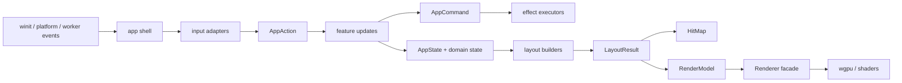

# Architecture

Status: target architecture.

This document describes the architecture `launchpad-windows` is moving toward.
It is the source of truth for the desired module boundaries, data flow,
ownership rules, and extension points. It is intentionally written as the New
Architecture, not as a catalog of the current implementation.

The migration plan for reaching this architecture is tracked separately in
[docs/DF_REARCHITECTURE_PLAN.md](docs/DF_REARCHITECTURE_PLAN.md).

## Architecture Goal

The launcher needs to support increasingly dynamic desktop UI features:

- folders on the launchpad grid;
- Liquid Glass surfaces whose size and position change at runtime;
- labels, editable text, overlays, and nested panels;
- animated open/close/reorder transitions;
- hit-testing that remains correct while UI geometry changes;
- small, local code contexts that are manageable for humans and AI agents.

The architecture goal is therefore:

```text
OS events
  -> App Shell
  -> feature/domain state
  -> layout + hit map
  -> renderer-neutral render model
  -> GPU renderer
```

Feature code decides **what the UI means**. Layout decides **where UI elements
are**. The renderer decides **how primitives are drawn**.

## Core Principles

- Keep the app shell thin.
- Keep features independent enough to edit without loading the whole app.
- Keep durable rules in domain modules, not in event handlers.
- Generate drawing data and hit-testing data from the same layout pass.
- Send renderer-neutral primitives to the renderer.
- Keep Windows, worker, and GPU side effects at the edges.
- Use stable IDs for anything that can animate, receive input, or persist.
- Prefer behavior-preserving refactors over large rewrites.

## Top-Level Layers



## Target Source Layout

```text
src/
  main.rs

  app/
    mod.rs
    state.rs
    event.rs
    input.rs
    update.rs
    command.rs
    frame.rs

  domain/
    app_id.rs
    app_registry.rs
    launcher_item.rs
    folders.rs
    settings.rs
    app_diff.rs

  features/
    app_list/
    search/
    edit_mode/
    folders/
    settings/
    bottom_control/
    icons/

  layout/
    mod.rs
    grid.rs
    folder_panel.rs
    settings_panel.rs
    bottom_control.rs
    hit_map.rs

  ui_model/
    mod.rs
    geometry.rs
    ids.rs
    render_model.rs
    text.rs

  renderer/
    mod.rs
    frame.rs
    glass.rs
    tiles.rs
    icons.rs
    text.rs
    controls.rs
    resources.rs

  platform/
    windows.rs
    launch.rs

  workers/
    icon_worker.rs
    refresh_watcher.rs
```

## Layer Responsibilities

| Layer | Responsibility |
| --- | --- |
| `main.rs` | Process entry point only: logger setup, event loop creation, app startup. |
| `app` | Application shell, event routing, global state orchestration, command execution, frame ticking. |
| `domain` | Durable data and pure rules: app IDs, launcher items, folders, ordering, settings, diffs. |
| `features` | User-facing behavior: search, edit mode, folders, settings, app list, icons, bottom control. |
| `layout` | Convert feature/domain state into rectangles, z-order, text placement, glass surfaces, and hit regions. |
| `ui_model` | Renderer-neutral primitives: IDs, geometry, `RenderModel`, `HitMap`, text styles, view structs. |
| `renderer` | GPU resources, pipelines, uploads, render pass ordering, shader-facing instance data. |
| `platform` | Windows hotkey, tray, app launch, OS window integration. |
| `workers` | Background scanning, icon extraction, cache work, and message production. |

## Forbidden Dependencies

These dependencies should not exist:

```text
features -> renderer
features -> platform
layout   -> renderer
domain   -> winit / wgpu / Win32
workers  -> app state / renderer
renderer -> features
```

Allowed dependency direction:

```text
app -> features -> domain
app -> layout -> ui_model
app -> renderer -> ui_model
app -> platform
app -> workers
```

`app` is allowed to coordinate many layers. Lower layers should not reach back
into `app`.

## App Shell

The app shell owns the outer runtime loop and connects the system together.

Responsibilities:

- implement the `winit` application handler;
- hold `AppState`;
- convert incoming events into `AppAction`;
- call feature update functions;
- execute `AppCommand` side effects;
- run per-frame ticking;
- build layout and submit `RenderModel` to the renderer;
- request redraws.

The app shell should not contain feature-specific layout math, edit-mode
reorder rules, settings-panel hit-testing, icon-cache policy, or GPU pipeline
details.

## Events, Actions, and Commands

All external input is normalized into app-level actions.

```rust
enum AppAction {
    PointerPressed { pos: Point },
    PointerMoved { pos: Point },
    PointerReleased { pos: Point },
    KeyPressed(KeyIntent),
    TextCommitted(String),
    Tick { now: Instant, dt: Duration },
    IconLoaded { app_id: AppId, image: DecodedIcon },
    AppListChanged(AppDiff),
    Summon,
    Hide,
    QuitRequested,
}
```

Feature update functions mutate state and return commands:

```rust
enum AppCommand {
    RequestRedraw,
    HideWindow,
    LaunchApp(AppLaunchInfo),
    PersistSettings(Settings),
    PersistLauncherState(LauncherState),
    QueueIconRequest(IconRequest),
    ResetIconCache,
}
```

Commands are side-effect requests. They are executed by the app shell or an
edge adapter, not by feature logic.

## Domain Model

The domain layer contains stable launcher concepts.

```rust
struct AppId(String);
struct FolderId(String);

enum LauncherItem {
    App(AppId),
    Folder(FolderId),
}

struct Folder {
    id: FolderId,
    name: String,
    children: Vec<AppId>,
}

struct LauncherState {
    items: Vec<LauncherItem>,
    folders: BTreeMap<FolderId, Folder>,
    hidden_apps: BTreeSet<AppId>,
}
```

Domain rules:

- App identity is stable and path-based.
- Launcher item order is user-owned state.
- Folder membership is user-owned state.
- Discovered app records and user launcher layout are separate concepts.
- Removing an app from the Start Menu must not silently corrupt folder/order
  state.
- Launching an app resolves through `AppId` into owned `AppLaunchInfo`.

## Feature Modules

Each feature owns its own state, update logic, and feature-specific commands.
Feature modules may expose layout inputs, but not GPU data.

Expected feature shape:

```text
features/<name>/
  mod.rs        # public surface and module purpose
  state.rs      # feature state
  action.rs     # feature-specific action types if needed
  update.rs     # state transitions
  tests.rs      # deterministic behavior tests
```

Feature boundaries:

- `features/search`: query state, matching policy, search focus behavior.
- `features/edit_mode`: long press, drag state, reorder, hide, folder creation
  gestures.
- `features/folders`: open/close folder, rename, child ordering, folder drag
  behavior.
- `features/settings`: selected category, settings actions, reset intents.
- `features/bottom_control`: search pill/page indicator/search field state
  machine.
- `features/icons`: UI-facing icon load/cache synchronization state.
- `features/app_list`: item filtering and app-list presentation rules.

## Layout

Layout converts active app state into a complete view of the frame.

```rust
struct LayoutResult {
    render: RenderModel,
    hits: HitMap,
}
```

Layout owns:

- page grid placement;
- folder panel size and child grid placement;
- settings panel geometry;
- bottom-control geometry;
- text placement;
- z-order;
- clipping intent;
- hit regions.

Layout must emit render geometry and hit regions from the same computed rects.
There should not be a separate "visual rect" and "hit rect" calculation for the
same UI element in different modules.

Text measurement is provided through an interface so layout can be tested
without owning the concrete text renderer:

```rust
trait TextMeasurer {
    fn measure_line(&mut self, text: &str, style: TextStyle) -> TextMetrics;
}
```

## UI Model

`ui_model` is the contract between layout and renderer.

```rust
struct RenderModel {
    glass: Vec<GlassSurface>,
    tiles: Vec<TileView>,
    icons: Vec<IconView>,
    text: Vec<TextView>,
    controls: Vec<ControlView>,
}

struct GlassSurface {
    id: UiId,
    rect: Rect,
    radius: f32,
    material: GlassMaterial,
    z: i16,
}

struct TextView {
    id: UiId,
    text: String,
    rect: Rect,
    style: TextStyle,
    z: i16,
}
```

The renderer receives UI primitives, not feature semantics. It does not know
whether a glass surface came from a folder, settings panel, or bottom control.

## Stable UI Identity

Anything interactive, animated, or persisted must have a stable `UiId`.

```rust
enum UiId {
    LauncherItem(LauncherItem),
    FolderPanel(FolderId),
    FolderTitle(FolderId),
    SettingsPanel,
    SettingsRow(SettingsRowId),
    BottomControl,
    BottomControlClose,
}
```

Stable IDs are used for:

- hit-testing;
- animation interpolation;
- focus tracking;
- drag tracking;
- preserving intent while app lists refresh.

## Hit Map

Hit-testing uses the layout result.

```rust
struct HitRegion {
    id: UiId,
    rect: Rect,
    target: HitTarget,
    z: i16,
}

struct HitMap {
    regions: Vec<HitRegion>,
}
```

Rules:

- Highest z-order wins.
- Disabled/invisible UI does not emit hit regions.
- Hit targets carry semantic intent, not renderer details.
- Pointer handling asks `HitMap` first, then dispatches an `AppAction`.

## Renderer

The renderer is a facade over GPU resources and draw passes.

Public direction:

```rust
impl Renderer {
    fn resize(&mut self, width: u32, height: u32);
    fn upload_icon_cell(&mut self, upload: IconCellUpload);
    fn prepare(&mut self, model: &RenderModel);
    fn render(&mut self, args: &FrameArgs);
}
```

Internal modules:

- `renderer::glass`: Liquid Glass surfaces and shape buffers.
- `renderer::tiles`: launcher item backgrounds.
- `renderer::icons`: icon atlas sampling and icon instances.
- `renderer::text`: glyph atlas and text instances.
- `renderer::controls`: procedural control ink.
- `renderer::frame`: pass ordering and frame orchestration.
- `renderer::resources`: common GPU helpers.

Renderer rules:

- No feature-specific concepts.
- No app state mutation.
- Shader layouts and Rust `#[repr(C)]` structs stay synchronized.
- New dynamic UI should usually add `RenderModel` primitives, not renderer
  methods.

## Platform and Workers

Platform modules own OS-specific integration:

- global hotkey;
- tray menu;
- window show/hide behavior;
- app launch adapter.

Worker modules own expensive background work:

- Start Menu scanning;
- app snapshot diff production;
- icon extraction;
- icon normalization;
- icon cache reads/writes where appropriate.

Rules:

- Workers send owned data back to the app shell.
- Workers do not mutate UI state.
- Workers do not touch the renderer.
- Windows handles and COM/GDI objects do not cross channels.

## Folder Architecture

Folders are a first-class validation case for this architecture.

Folder open flow:

```text
PointerReleased on LauncherItem::Folder
  -> AppAction::OpenFolder(FolderId)
  -> features/folders updates open folder state
  -> layout/folder_panel emits:
       GlassSurface for panel
       TextView for title
       IconView/TextView for children
       HitRegion values for panel, title, children, close/outside
  -> Renderer draws primitives without folder-specific branches
```

Drag-to-folder flow:

```text
edit_mode drag state
  -> HitMap reports folder/app hover target
  -> features/edit_mode decides create-folder or move-into-folder intent
  -> domain updates LauncherState
  -> layout recomputes grid/folder panel
```

The important boundary is that folder behavior lives in domain/features/layout,
while the renderer only sees primitives.

## Extension Rules

When adding a new visible feature:

1. Define durable state in `domain` if it must persist or affect launcher
   identity.
2. Define transient behavior in `features/<name>`.
3. Define layout output in `layout/<name>.rs`.
4. Add renderer-neutral primitives to `ui_model` only if existing primitives
   are insufficient.
5. Extend `renderer` only when a new primitive requires new GPU behavior.
6. Add tests at the lowest layer that can express the behavior.

When changing input behavior:

1. Normalize raw input into `AppAction`.
2. Use `HitMap` for geometry-dependent pointer decisions.
3. Keep side effects as `AppCommand`.

When changing rendering:

1. Prefer changing `RenderModel` generation.
2. Keep feature names out of renderer modules.
3. Verify shader/Rust buffer layouts together.

## Context Budget Rules

- `main.rs` should remain small and contain only startup wiring.
- `app` files should coordinate, not implement feature details.
- Feature files should usually stay below 700 lines.
- Files above 1000 lines indicate a missing boundary.
- Every feature directory should be understandable on its own.
- Architecture docs should describe stable boundaries, not every implementation
  detail.
