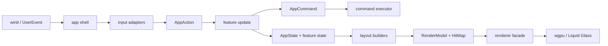

# DF Rearchitecture Plan

Status: revised migration plan.

DF means Dynamic Feature-ready. The goal is to support folders, dynamically
resized Liquid Glass surfaces, labels, overlays, and animation without pushing
more feature logic into `src/main.rs` or `src/renderer.rs`.

This is a planning document. The target architecture is
[../ARCHITECTURE.md](../ARCHITECTURE.md).

Implementation progress, completed slices, validation results, and discoveries
from migration work are recorded in
[DF_REARCHITECTURE_LOG.md](DF_REARCHITECTURE_LOG.md).

## Problem

The app has grown around a central `App` in `src/main.rs`. That was a practical
shape for the MVP, but it now creates two problems:

- Feature changes require reading too much unrelated code.
- AI coding agents often need more context than fits comfortably in a single
  task window.

The solution is not to introduce a large framework. The useful move is to make
boundaries explicit enough that each feature has a small, predictable context.

## Target Style

Use a pragmatic App Shell plus Feature/Domain/Layout/Render Model split.



The rule is simple: feature code produces state, layout inputs, commands, and
renderer-neutral UI data. It does not directly own windows, GPU resources, or
Windows handles.

## Target Source Map

The final layout can be introduced incrementally.

```text
src/
  main.rs                 # process entry point only

  app/
    mod.rs                # AppShell: winit ApplicationHandler glue
    state.rs              # AppState and cross-feature state
    event.rs              # UserEvent, AppAction, AppCommand
    input.rs              # WindowEvent/UserEvent -> AppAction
    update.rs             # AppState + AppAction -> Vec<AppCommand>
    command.rs            # execute side effects at the app boundary
    frame.rs              # per-frame tick and redraw orchestration

  domain/
    app_id.rs
    app_registry.rs
    launcher_item.rs      # LauncherItem::App / LauncherItem::Folder
    folders.rs            # FolderId, Folder, folder contents
    settings.rs

  features/
    app_list/
    search/
    edit_mode/
    folders/
    settings/
    bottom_control/
    icons/

  layout/
    mod.rs                # compose feature layouts into one LayoutResult
    grid.rs               # page grid for LauncherItem
    folder_panel.rs       # dynamic folder glass and child grid
    settings_panel.rs
    bottom_control.rs
    hit_map.rs

  ui_model/
    mod.rs                # RenderModel, UiId, primitive view structs
    geometry.rs           # Rect, Size, Insets, z-layer helpers
    text.rs               # TextView, TextStyle, TextMeasurer trait

  renderer/
    mod.rs                # Renderer facade
    frame.rs              # render pass orchestration
    tiles.rs
    icons.rs
    text.rs
    controls.rs
    glass.rs
    resources.rs

  platform/
    windows.rs
    launch.rs

  workers/
    icon_worker.rs
    refresh_watcher.rs
```

Existing files should move only when the receiving boundary is clear. For
example, `grid.rs` can first stay in place while its public API changes from
apps to launcher items.

## Layer Responsibilities

| Layer | Owns | Must not own |
| --- | --- | --- |
| `main.rs` | Process startup and logger setup | Feature logic, layout, rendering details |
| `app` | winit lifecycle, state orchestration, action/command flow | GPU pipelines, Windows APIs hidden behind `platform`, feature internals |
| `domain` | Durable data and pure rules: app ids, folders, registry, settings | winit, wgpu, Win32 handles, frame timing |
| `features` | User-facing behavior and feature state | Direct GPU calls, direct Win32 calls, global event-loop control |
| `layout` | Rects, z order, dynamic glass sizes, labels, hit regions | GPU resources, side effects, app scanning |
| `ui_model` | Renderer-neutral drawing primitives and hit targets | Feature decisions, GPU allocation |
| `renderer` | GPU resources, shader pipelines, uploads, render passes | App business rules, hit-testing decisions |
| `platform` | Windows hotkey, tray, launch, OS window integration | Feature state mutation |
| `workers` | Background scanning/extraction/caching | UI state or renderer access |

## Event and Command Boundary

Every user or background event should move toward this shape:

```text
WindowEvent/UserEvent
  -> app::input maps it to AppAction
  -> app::update dispatches to feature/domain logic
  -> state is updated
  -> zero or more AppCommand values are returned
  -> app::command executes side effects
  -> layout builds LayoutResult from state
  -> renderer consumes RenderModel
```

Example actions:

```rust
enum AppAction {
    PointerPressed { x: f32, y: f32 },
    PointerMoved { x: f32, y: f32 },
    PointerReleased { x: f32, y: f32 },
    SearchTextCommitted(String),
    IconLoaded { app_id: AppId, image: DecodedIcon },
    RefreshDiff(AppDiff),
    OpenSettings,
    CloseSettings,
    Tick { now: Instant, dt: Duration },
}
```

Example commands:

```rust
enum AppCommand {
    RequestRedraw,
    HideWindow,
    LaunchApp(AppLaunchInfo),
    PersistSettings(Settings),
    PersistUserOrder(Vec<AppId>),
    QueueIconRequest(IconRequest),
    ResetIconCache,
}
```

Commands are the side-effect boundary. Feature code may request a command, but
only the app shell or a platform/worker adapter executes it.

## Render Model Boundary

Dynamic UI should cross into the renderer as data, not as feature-specific
calls.

```rust
struct RenderModel {
    glass: Vec<GlassSurface>,
    tiles: Vec<TileView>,
    icons: Vec<IconView>,
    text: Vec<TextView>,
    controls: Vec<ControlView>,
}

struct LayoutResult {
    render: RenderModel,
    hits: HitMap,
}
```

The renderer should not know about "folder open", "settings selected category",
or "search mode". It should know about glass surfaces, icons, text runs,
control instances, z order, clipping, and uploads.

This boundary makes dynamic features manageable:

- Resizable Liquid Glass is a changed `GlassSurface` rect/radius.
- New labels are new `TextView` values.
- Folder overlays are additional z-layered surfaces, icons, and text.
- Animation can interpolate stable `UiId` values across frames.
- Hit-testing uses the same layout data that produced the render model.

## Stable Identity

All dynamic UI pieces that can animate, receive input, or persist state need a
stable id.

```rust
enum LauncherItem {
    App(AppId),
    Folder(FolderId),
}

enum UiId {
    LauncherItem(LauncherItem),
    FolderPanel(FolderId),
    FolderTitle(FolderId),
    SettingsPanel,
    BottomControl,
}
```

Stable ids prevent bugs where a rescan, reorder, or folder edit causes a click
or animation to apply to the wrong visual item. Current stable app-slot
behavior in `AppRegistry` should be preserved.

## Layout and Hit-Testing

Layout should be the source of truth for both drawing and pointer targets.

Do not compute a visual rect in one module and a separate approximate hit rect
elsewhere. The layout layer should emit both:

```rust
struct HitRegion {
    id: UiId,
    rect: Rect,
    target: HitTarget,
    z: i16,
}
```

The app shell should ask the current `HitMap` what was hit and then dispatch an
action. It should not manually duplicate feature geometry.

Text measurement should be passed into layout through a small interface instead
of letting layout own the full text renderer:

```rust
trait TextMeasurer {
    fn measure_line(&mut self, text: &str, style: TextStyle) -> TextMetrics;
}
```

That keeps dynamic labels testable while still allowing the real implementation
to use `cosmic-text`.

## Folder Feature Target

Folders are the feature that should validate the architecture.

Domain model:

```rust
struct Folder {
    id: FolderId,
    name: String,
    children: Vec<AppId>,
}

enum LauncherItem {
    App(AppId),
    Folder(FolderId),
}
```

Feature responsibilities:

- Open and close a folder.
- Rename a folder.
- Drag apps into, out of, and between folders.
- Create a folder by dragging one app over another.
- Track open/close and drag animation state.
- Emit persistence commands for folder contents and item order.

Layout responsibilities:

- Lay out `LauncherItem` values in the main grid.
- Lay out an open folder panel from title, child app count, viewport, and text
  metrics.
- Produce the folder panel Liquid Glass surface with dynamic size.
- Produce folder title and child labels as `TextView` values.
- Produce all hit regions from the same rects.

Renderer responsibilities:

- Render the folder panel as just another `GlassSurface`.
- Render child icons and labels using the same icon/text primitives.
- Remain unaware of folder semantics.

## Renderer Direction

`Renderer` should become a facade with a smaller public API:

```rust
impl Renderer {
    fn resize(&mut self, width: u32, height: u32);
    fn upload_icon_cell(&mut self, cell: IconCellUpload);
    fn prepare(&mut self, model: &RenderModel);
    fn render(&mut self, frame: &FrameArgs);
}
```

Internally, split pipeline/resource code by primitive type:

- `renderer::glass` for Liquid Glass surfaces and shape buffers.
- `renderer::tiles` for launcher item tile backgrounds.
- `renderer::icons` for icon atlas sampling.
- `renderer::text` for glyph atlas and text instance uploads.
- `renderer::controls` for procedural control ink.
- `renderer::frame` for pass ordering.

New features should add primitives to the render model, not new feature-specific
render branches.

## Migration Plan

The migration should proceed as behavior-preserving vertical slices, not as
large horizontal "add types first, wire later" phases. A model that has not
been checked against current behavior is provisional. Each phase below must
start from the current implementation, describe the exact behavior it preserves,
then move one user-visible slice behind the new boundary.

Each phase should compile, preserve behavior, and leave the app in a usable
state. Prefer one completed vertical slice over broad unused abstractions.

### Phase 0: Guardrails and Behavior Inventory

- Keep [../ARCHITECTURE.md](../ARCHITECTURE.md) focused on the target
  architecture.
- Keep this document focused on migration order and slice rules.
- Build and maintain a current-behavior inventory before extracting a feature:
  visible primitives, hit regions, press/release rules, drag rules, side
  effects, persistence, and platform behavior.
- Treat any renderer-neutral model as incomplete until at least one current
  UI slice uses it end to end.
- When touching a bloated area, extract toward a planned boundary instead of
  adding unrelated code to `main.rs`.

### Phase 1: Settings Overlay Vertical Slice

Use the settings overlay as the first real validation case because it is
contained, modal, currently rendered from `main.rs`, and has meaningful hit
behavior.

- Inventory current settings behavior:
  - open from gear/tray and close by close button or outside modal click;
  - outside modal click must not replay input to the underlying app;
  - category switching;
  - sort segment behavior, including name sort resetting manual order;
  - frequent-apps and search-hidden toggles;
  - reset icon cache and reset settings actions;
  - panel animation alpha/scale and close behavior.
- Introduce or refine typed settings intents as needed. Avoid untyped string
  targets when a current setting action has a durable meaning.
- Move settings panel geometry, text placement, control instances, glass
  surface, and hit regions into `layout/settings_panel.rs`.
- Emit one `LayoutResult` for the settings overlay: `RenderModel` primitives
  and `HitMap` regions must come from the same rect calculations.
- Add a narrow settings-only `AppAction` / `AppCommand` path if needed to
  preserve behavior clearly. Do not wait for a global app-shell extraction.
- Keep renderer changes adapter-like: it is acceptable for this phase to
  translate settings `RenderModel` primitives back into existing renderer
  upload calls rather than completing the full renderer facade.
- Add tests for settings geometry, hit ordering, click intents, and settings
  side-effect commands.
- Run the Screen Verification Gate for settings.

### Phase 2: Bottom Control and Search Vertical Slice

Move the bottom control and search field behind the same boundaries validated
by settings.

- Inventory current bottom-control behavior:
  - search pill, page indicator, search field, close button, caret, preedit;
  - page-change indicator timing;
  - IME enable/disable and cursor area;
  - search text entry, backspace, left/right, Esc, IME commit/preedit;
  - search filtering and empty-query behavior;
  - edit-mode Done and settings gear visual/hit behavior.
- Move bottom-control geometry and hit regions into `layout/bottom_control.rs`.
- Move search query behavior into `features/search/` only as far as the slice
  needs; preserve existing filtering.
- Ensure text roles and measurement cover query, placeholder, preedit, caret,
  and control labels.
- Emit `LayoutResult` for bottom control/search and route pointer/text intents
  through the narrow action/command path.
- Add tests for control state transitions, hit targets, text intents, IME
  state decisions where deterministic, and search matching.
- Run the Screen Verification Gate for search and bottom control.

### Phase 3: Launcher Grid and Click Passthrough Vertical Slice

Move the main launcher grid layout and click targets behind the model while
preserving scroll and transparent-area behavior.

- Inventory current grid behavior:
  - page frame geometry and clipping;
  - tile, icon, label, placeholder, and app launch hit regions;
  - transparent-area stationary click hides the launcher and replays a left
    click to the underlying window;
  - drag beyond slop becomes scroll instead of launch;
  - horizontal drag, inertia, snap, rubber-band, resize, and DPI scaling.
- Move grid visual rects and hit regions into `layout/grid.rs` or an adapter
  around the current `grid.rs`.
- Keep stable app launch resolution through `AppId`; release should launch the
  pressed app id, not whatever moved under the cursor.
- Represent transparent launcher backdrop separately from modal backdrops so
  click replay remains explicit.
- Add focused action/command coverage for app launch, hide, and
  hide-with-click-passthrough.
- Add tests for app hit regions, label hit area, empty misses, passthrough
  intent, scroll-vs-click classification, and DPI-sensitive geometry.
- Run the Screen Verification Gate for launcher display, resize, scroll/snap,
  icons/labels, launch hit targets, and click passthrough.

### Phase 4: Edit Mode Vertical Slice

Extract edit-mode behavior after the grid and bottom-control models can express
the relevant hit regions.

- Inventory current edit-mode behavior:
  - long press entry;
  - icon wiggle/lift/drag/reorder;
  - edit badge hide;
  - empty-cell drop targets;
  - edge autoscroll;
  - Done exit;
  - settings gear;
  - persistence of order and hidden apps.
- Move edit-mode state transitions into `features/edit_mode/`.
- Ensure layout emits edit badges, dragged icon visual state, edit settings
  gear, and empty drop-cell hit regions from the same geometry as rendering.
- Add commands for persistence and redraw requests instead of performing those
  side effects inside feature logic.
- Add tests for long-press classification, reorder targets, hidden-app
  behavior, empty-cell drops, and edge-scroll trigger decisions.
- Run the Screen Verification Gate for edit mode.

### Phase 5: App Shell Consolidation

Only after several vertical slices have proven the action/command shape, pull
the common shell out of `main.rs`.

- Add `app/event.rs`, `app/input.rs`, `app/update.rs`, `app/command.rs`, and
  `app/frame.rs`.
- Move the already-proven settings/search/grid/edit action and command paths
  into the app shell modules.
- Keep `main.rs` as process startup plus event-loop wiring.
- Keep platform, worker, and renderer side effects at the app boundary.
- Add tests for action dispatch and command production where deterministic.

### Phase 6: Renderer Facade Split

Split renderer internals after the `RenderModel` has been exercised by real
settings, bottom-control, grid, and edit-mode slices.

- Keep the public `Renderer` type while moving internals to `renderer/`
  modules.
- Replace feature-specific setter growth with `prepare(&RenderModel)` where
  the model has proven stable.
- Generalize Liquid Glass shape submission from fixed overlay slots toward a
  list of `GlassSurface` primitives.
- Keep shader layouts and Rust `#[repr(C)]` structs synchronized.
- Preserve WGSL validation coverage.

### Phase 7: Item-Based Launcher Domain

Introduce folders only after the grid and interaction boundaries are stable.

- Add `LauncherItem`, `FolderId`, and `Folder`.
- Change grid layout from app-only to item-based without changing app launch
  resolution through stable `AppId`.
- Persist item order and folders separately from discovered app registry data.
- Ensure refresh/removal behavior does not corrupt user-owned order or folder
  membership.
- Add tests for item ordering, app removal, app launch resolution, and
  persistence boundaries.

### Phase 8: Folder Feature Vertical Slice

Build folders as the feature that validates the full target architecture.

- Implement folder open/close as feature state.
- Implement folder panel layout using dynamic `GlassSurface`, `TextView`,
  child icon/label primitives, and hit regions.
- Implement folder rename and child ordering.
- Implement drag-to-create and drag-into-folder using `HitMap` regions and
  edit-mode intents.
- Validate that the renderer receives no folder-specific concepts.
- Run the Screen Verification Gate for folder open/close, rename, dragging,
  labels, and animation.

## Context Budget Rules

- `main.rs` should trend toward process startup only.
- `app/mod.rs` and `ApplicationHandler` should stay thin. If a match arm needs
  feature knowledge, move it behind `AppAction`.
- Prefer files around 300-700 lines. Treat 1000 lines as a warning that a
  boundary is missing.
- A file should not contain more than one feature's state, layout, input, and
  rendering glue at the same time.
- Each feature directory should have a small `mod.rs` comment that explains its
  state, actions, layout entry point, and tests.
- New dynamic UI should first define its domain state and render-model output;
  only then add renderer support if an existing primitive is insufficient.

## Screen Verification Gate

Rearchitecture work must preserve user-visible behavior. A migration slice is
not complete until the app has been launched and the affected UI has been
checked on screen.

For every slice that touches event handling, layout, rendering, hit-testing,
animation, window behavior, search, settings, edit mode, folders, icons, or
Liquid Glass:

- Run `cargo run --release`.
- Verify that the launcher window appears and paints a non-blank first frame.
- Verify resize behavior and DPI-sensitive layout when the slice can affect
  geometry.
- Verify horizontal scroll, drag, inertia, snap, and rubber-band behavior when
  the slice can affect input or layout.
- Verify search open/close, text entry, IME commit behavior, and filtering when
  the slice can affect search or bottom-control code.
- Verify edit mode entry/exit, icon drag, reorder, hide, Done, and settings gear
  when the slice can affect edit-mode or pointer routing.
- Verify settings overlay open/close, category switching, toggles, and reset
  controls when the slice can affect settings.
- Verify icon placeholders, cached icons, loaded icons, labels, and launch
  click targets when the slice can affect app registry, icon sync, or layout.
- Capture or inspect the screen using available desktop/screenshot tooling when
  possible. If automated screen inspection is unavailable, explicitly record
  the manual checks that were performed.
- If the app cannot be launched or the screen cannot be inspected, leave the
  slice unfinished and report the blocker instead of claiming verification.

The expected review artifact for UI-affecting slices is a short checklist in
the PR body or final agent report:

```text
Screen verification:
- Launched with cargo run --release: yes/no
- First frame non-blank: yes/no
- Resize checked: yes/no/not affected
- Scroll/snap checked: yes/no/not affected
- Search checked: yes/no/not affected
- Edit mode checked: yes/no/not affected
- Settings checked: yes/no/not affected
- Icons/labels/launch hit targets checked: yes/no/not affected
- Notes:
```

## Validation

For each migration slice:

- Run `cargo fmt`.
- Run `cargo test`.
- Run `cargo clippy --all-targets --all-features` when the change is more than
  a mechanical move.
- Apply the Screen Verification Gate for any UI-affecting slice.
