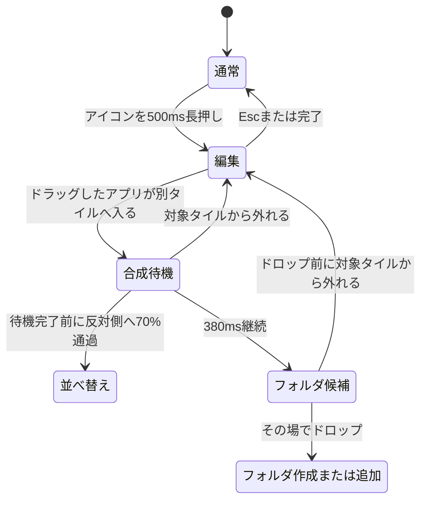

# フォルダ操作仕様

## 目的

通常の並べ替えとフォルダ作成を競合させず、iOS に近い予測可能な操作にするための仕様です。入力判定は描画とは分離し、`layout::edit_mode` の純粋なジオメトリ関数と `features::folders` の時間状態で決定します。

## Apple 公式ガイドから確認できる操作

- ホーム画面を長押しし、アプリが揺れる編集状態に入ってから移動する。
- アプリを別のアプリへ重ねるとフォルダを作成する。
- 追加のアプリは、作成済みのフォルダへドラッグして入れる。
- フォルダは複数ページを持てる。
- アプリを画面端へ運び、少し待つと別ページへ移動できる。
- フォルダから出す場合は、フォルダを開いて編集状態にし、アプリをホーム画面へドラッグする。

参照:

- [iPhoneでホーム画面のアプリやウィジェットを移動する](https://support.apple.com/ja-jp/108307)
- [iPhoneのホーム画面でアプリをフォルダに整理する](https://support.apple.com/ja-jp/guide/iphone/iph822ece7dd/ios)
- [iPhoneのホーム画面でアプリやウィジェットを移動する](https://support.apple.com/ja-jp/guide/iphone/iphd2fc8ce30/ios)

Apple は重なり判定の面積や待機時間を公開していません。以下の数値は、上記の操作原則をこのアプリで安定して再現するための実装上の推定です。

## 状態遷移

## 入力の優先順位

1. 編集中の削除バッジや明示的なコントロール。
2. ドラッグ中に別タイルへ入った場合のLiquid Glass融合とフォルダ待機。
3. アプリ同士では、待機完了前に対象を反対側へ70%通過した場合の通常のライブ並べ替え。既存フォルダは位置を動かさず、融合・スプリングオープン判定を優先します。
4. ページ端でのページ移動。

別タイルへ入った時点から、ドラッグ側と対象側のLiquid Glassを同じinteraction layerへ出し、smooth-minで溶けるような融合を開始します。その場で380ms維持するとフォルダ候補になり、ドロップ時に初めてデータを変更します。一方、待機完了前に対象タイルを進行方向の反対側へ70%通過すると並べ替えが優先されます。通過率は `FOLDER_REORDER_CROSS_FRACTION` に集約し、手動QAで調整可能にしています。

## フォルダ内の編集

- 通常状態では、子アプリの短いクリックは起動、横方向の移動はページスワイプです。
- 子アプリを500ms長押しすると、通常画面と同じ編集モードへ入り、同じ wiggle 表現を使います。
- 長押し成立時は、そのpressで選んだ子アプリを即座に持ち上げます。編集モードへ入るためのpressをページスワイプへ再利用しません。
- 編集中は子アプリのドラッグをページスワイプより優先します。空き領域からは編集を維持したままページをスワイプできます。
- 子アプリを左右の端領域で260ms保持すると、pointerを離さず隣のフォルダページへ移動します。1回の保持で1ページだけ移動し、中央へ戻すまで連続送りしません。先頭・末尾ページの外向きの左右端はフォルダ内に留まります。
- 子アプリを上端または下端から28px以上出すとフォルダを閉じ、同じpointerを離さずメイングリッドのドラッグへ引き継ぎます。左右はページ移動、上下は取り出しと役割を分け、ページを移ろうとした子アプリが誤ってフォルダ外へ出ることを防ぎます。取り出したアプリは最初に元フォルダの位置へ置かれ、その後は通常のライブ並べ替えで配置先を選べます。
- フォルダ内の順序変更は安定したアプリIDをキーにしたスプリングで補間し、移動対象以外の子アプリもメイングリッドと同じように新しいセルへ滑ります。
- 編集中に空き領域を移動せずクリックすると、通常画面の空白クリックと同様に編集モードを終了します。
- 編集中の各子アプリには×バッジを表示し、選択すると通常画面と同じ非表示処理を行います。
- フォルダ名は編集モード中にタイトルを選択すると編集できます。IME、UTF-8カーソル、Enter確定、Esc取消に対応します。
- フォルダ名にはアプリ名と同じ多層ドロップシャドウを適用し、Glass Focus Veilや動く背景の上でもコントラストを保ちます。
- Esc は、名前編集中なら名前編集の取消、通常のフォルダ編集状態なら編集モード終了、非編集状態ならフォルダを閉じる、の順です。

## トップレベルの並べ替えとフォルダ表示

- 同じ行の並べ替えはフォルダ化待機との誤吸着を避けるため対象セルの横方向70%通過で確定します。この深い通過判定を行の取得には適用せず、異なる行では対象行へ進行方向から25%入った時点で確定します。異なる行では列の距離に関係なく縦方向を優先します。
- 判定にはスプリング補間中の見た目の位置ではなく固定グリッドセルを使います。直前の並べ替えでアイコンが行間を移動中でも、判定軸がフレームごとに変わりません。
- 閉じたフォルダを編集モードで持ち上げても、フォルダ内の小アイコンを表示し続けます。フォルダのLiquid Glass面、×バッジ、小アイコンは共通の中心と位相を持つ一体のグループとしてwiggleし、ドラッグ時はその位相を0へ戻さず、傾きと上下動を連続して引き継ぎます。相対配置を保ったまま1.15倍へ拡大してpointerへ追従します。小アイコンはGPUの`drag_pos`、Liquid Glass面はRenderModel上のsurface座標で動くため、並べ替えが起きないpointer moveでもsurfaceだけを同期し、全体relayoutには依存させません。持ち上げたGlass面は通常フォルダとは別のSDFレーンで、通常アイコン・バッジの後、小アイコンの直前に描画します。このため下のアプリアイコンへ潜らず、別フォルダのGlass面ともsmooth unionしません。

## ページング

フォルダ内も通常画面と同じ `Scroller` を使います。入力への1:1追従、速度推定、1ページ単位のスナップ、端のラバーバンドを共有します。1ページだけの場合も、ドラッグ中はラバーバンド位置を保持し、リリース後にだけ0へスプリング復帰します。全ページの配置は固定サイズのフォルダパネルをページ幅とし、GPU のモーダルクリップでスワイプ途中の内容とLiquid Glassの×バッジをパネル内に制限します。ドラッグ中のアプリアイコンだけはクリップ外へ描画し、左右端でのページ移動と上下端でのメイングリッド移動を可能にします。

## 永続化の原則

ホバーやアニメーション中はプレビュー順だけを更新します。フォルダ外へ出た子アプリは、ドラッグをメイングリッドへ引き継ぐため一時的にトップレベルモデルへ移しますが、永続化はしません。フォルダ作成、既存フォルダへの追加、フォルダ内並べ替え、フォルダ外への移動は、妥当なドロップが完了した時点で保存します。
