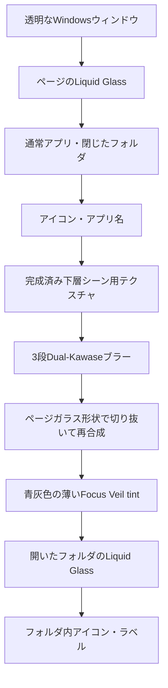

# Glass Focus Veil

## 概要

Glass Focus Veil（グラス・フォーカス・ヴェール）は、フォルダまたは設定画面を
開いたときに、モーダルより下にあるランチャーの表示をぼかして視線を前面の
操作対象へ集めるためのGPUエフェクトです。

単純な黒い半透明レイヤーではありません。ページのLiquid Glass、通常アプリ、
閉じたフォルダ、アイコン、ラベルまでを含む「完成済みの下層シーン」を一度
テクスチャへ描画し、そのテクスチャをぼかしてからページガラスの形状内へ
再合成します。開いたフォルダまたは設定パネルのLiquid Glassと内容は、その後に
シャープな状態で描画します。

設定パネル自体は `GlassMaterial::Prominent` を使用します。背面を覆うFocus Veilとは
連携して、パネルの角丸内だけ完成済み下層シーンのブラー結果を20 px広域の
9タップで追加平滑化します。さらにパネル内で混ぜるシャープな背景サンプルを
なくし、淡いtintを少し強めることで、通常のフォルダよりも曇りガラスに近い
見た目にしています。

このエフェクトが守るべき要件は次のとおりです。

- 通常アプリ、別の閉じたフォルダ、アイコン、アプリ名を同じ下層としてぼかす。
- 開いたフォルダまたは設定パネルのLiquid Glassと内容はぼかさない。
- 効果範囲をメインのページガラスと同じ矩形・角丸に限定する。
- ページガラス外の透明なウィンドウ領域へ色やブラーを出さない。
- ページガラスの輪郭はシャープに残す。
- フォルダまたは設定パネルの開閉アニメーションと連続的に強度を変化させる。

## 描画順



画面上のレイヤーを手前から並べると次のようになります。

```text
手前    フォルダ内アイコン・ラベル       シャープ
        開いたフォルダのLiquid Glass     シャープ
        薄い青灰色のFocus Veil tint
        ぼかした下層シーン               ページガラス内のみ
        通常アプリ・閉じたフォルダ・名前
奥      ページのLiquid Glass
```

## 効果範囲

効果範囲はウィンドウ全体ではなく、`GridLayout::frame_panel_rect` が返す
固定ページフレームです。角丸も `FRAME_CORNER_RADIUS` を使用します。

```text
┌────────────── 透明ウィンドウ ──────────────┐
│                                             │
│    ╭──────── メインページガラス ────────╮    │
│    │                                    │    │
│    │   Glass Focus Veil                 │    │
│    │   + 下層シーンブラー                │    │
│    │                                    │    │
│    ╰────────────────────────────────────╯    │
│                                             │
└─────────────────────────────────────────────┘
```

ページガラスの境界から内側12 pxは、シャープな下層シーンからブラーへ徐々に
切り替える領域です。この内側マスクにより、透明領域の色がブラーへ混ざることと、
ページガラスの輪郭自体がぼやけることを防ぎます。

## ブラー処理

ブラーには、既存のLiquid Glassと同系統のDual-Kawase方式を使用します。
完成済みの下層シーンを3段階で縮小し、その後3段階で拡大します。

```text
下層シーン（原寸）
    ↓ downsample
L1（1/2）
    ↓ downsample
L2（1/4）
    ↓ downsample
L3（1/8）
    ↑ upsample
L2（1/4）
    ↑ upsample
L1（1/2）
    ↑ upsample
ブラー結果（原寸）
```

各段は別のコマンドエンコーダーで実行します。wgpu/D3D12では、同じテクスチャを
連続するパスで書き込み先と読み込み元にする場合、使用スコープを分ける必要が
あるためです。

ブラー強度が0の場合、ブラー用の縮小・拡大パスは実行しません。ただし通常時も
下層シーン用テクスチャへ描画し、最終合成パスを通してスワップチェーンへ戻します。
これにより、フォルダを開くフレームでも描画経路が切り替わらず、見た目の飛びを
防ぎます。

## アニメーション

`InkView::scene_blur` は、レンダラーに依存しない0.0〜1.0のブラー要求値です。
フォルダパネルと設定パネルでは、それぞれのスムージング済み開閉進捗をそのまま
設定します。

```text
閉じた状態       scene_blur = 0.0
開いている途中   scene_blur = progress
開いた状態       scene_blur = 1.0
閉じている途中   scene_blur = progress（減少）
```

薄い色のヴェールも同じ進捗へ追従します。現在の最大不透明度は0.14です。視覚分離の
主役はブラーであり、色は残ったコントラストを少し抑える補助として扱います。

## 実装の対応関係

| 責務 | 実装 |
|---|---|
| 共通のVeil形状・色・強度を生成する | `src/layout/focus_veil.rs` |
| ページフレーム形状と開閉進捗をエフェクトへ渡す | `src/layout/folder_panel.rs`、`src/layout/settings_panel.rs` |
| レンダラー中立なブラー要求値 | `src/ui_model/render_model.rs` の `InkView::scene_blur` |
| 下層シーンとモーダルの描画順を分割する | `src/renderer/frame.rs` |
| 設定パネルのProminent材質をブラー・tintへ反映する | `src/renderer/frame.rs`、`src/renderer/focus_blur.rs`、`src/liquid_glass/renderer.rs`、`src/shader_focus_blur.wgsl`、`assets/shaders/liquid_glass_final.wgsl` |
| 中間テクスチャ、ブラー段、合成パイプラインを管理する | `src/renderer/focus_blur.rs` |
| 角丸マスク、12 px境界遷移、シャープ/ブラー合成 | `src/shader_focus_blur.wgsl` |
| Dual-Kawaseの縮小シェーダー | `assets/shaders/liquid_glass_blur_downsample.wgsl` |
| Dual-Kawaseの拡大シェーダー | `assets/shaders/liquid_glass_blur_upsample.wgsl` |

最終合成シェーダーでは、クリップ空間とテクスチャ空間のY軸原点が異なるため、
スワップチェーンへ戻すときにY座標を一度だけ反転します。この反転を削除すると、
ランチャーの下層シーンが上下逆に表示されます。

## 最終RGBAと透過

タイル、アイコン、Liquid Glass、Focus Veilを含む内部合成は、透明境界で暗い縁を
作らないようpremultiplied RGBAで行います。macOSで利用可能な
`CompositeAlphaMode::PostMultiplied` とPNGはstraight RGBAを期待するため、完成した
フレームを `src/renderer/presentation.rs` の専用テクスチャへ描き、最終フルスクリーン
パスでRGBだけをalphaで割ってからsurfaceまたはQA PNGへ出力します。alpha自体は
変更しません。

この変換を省くと、premultipliedのRGBへプラットフォームやPNGビューアがalphaを
もう一度掛けるため、実際のalpha値よりも暗く、透過が強いように見えます。

## 調整するときの基準

### ブラーを強くしたい場合

- ピラミッド段数を増やすと大きくぼけますが、GPUパスと中間テクスチャが増えます。
- 設定パネル内だけの追加ブラー半径は `src/renderer/frame.rs` の
  `PROMINENT_FOCUS_BLUR_SPREAD` で調整します。
- サンプルオフセットやカーネルを変更する場合は、既存Liquid Glassのブラーとの
  見た目の整合性も確認します。
- `scene_blur` は現在、ぼけた結果とシャープな結果の混合率です。1.0を超える値は
  合成シェーダーで1.0へクランプされます。

### 色を調整したい場合

- 色と最大不透明度は `src/layout/folder_panel.rs` で調整します。
- 黒の不透明度を上げて視認性を作るのではなく、まずブラーで情報量を減らします。
- Liquid Glassらしさを保つため、色は低彩度・低不透明度を基本とします。

### 境界を調整したい場合

- 12 pxの内側遷移は `src/shader_focus_blur.wgsl` の `smoothstep` で調整します。
- 0 pxに近づけるほど境界でブラーが急に切り替わります。
- 大きくしすぎると、ページ端付近のアイコンだけシャープに見える領域が増えます。

## 壊してはいけない条件

- モーダルフォルダを下層シーン用テクスチャへ描かない。
- 全画面矩形をブラーの切り抜き形状として使用しない。
- 色付きヴェールだけで下層を隠す実装へ戻さない。
- ページフレームと別の角丸値をハードコードしない。
- 下層シーンの描画完了前にブラー処理を開始しない。
- 縮小・拡大パスを同じwgpu使用スコープへまとめない。
- 最終合成時のY座標反転を削除しない。

## 視覚QAチェックリスト

- 開いたフォルダ内のアイコンとラベルがシャープである。
- 通常アプリのアイコンと名前が同時にぼける。
- 別の閉じたフォルダと、そのミニアイコンもぼける。
- ブラーがページガラスの角丸内だけに存在する。
- ページ外の透明領域に色やブラーが出ない。
- ページガラスの輪郭がシャープに残る。
- 開く途中でブラーが徐々に強くなる。
- 閉じる途中でブラーが徐々に解除される。
- 開閉の最終フレームで上下反転、点滅、色の飛びが発生しない。
- リサイズまたはDPI変更後も、ブラー用テクスチャと効果範囲が画面サイズへ追従する。

透明ウィンドウを含む実機確認方法は
[`EDIT_MODE_VISUAL_QA.md`](EDIT_MODE_VISUAL_QA.md) を参照してください。
