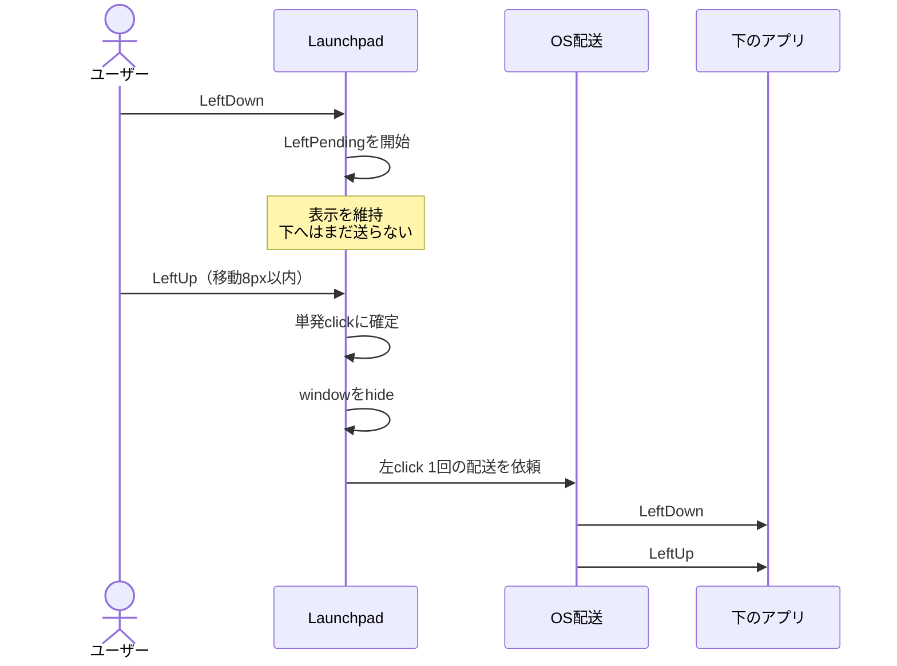
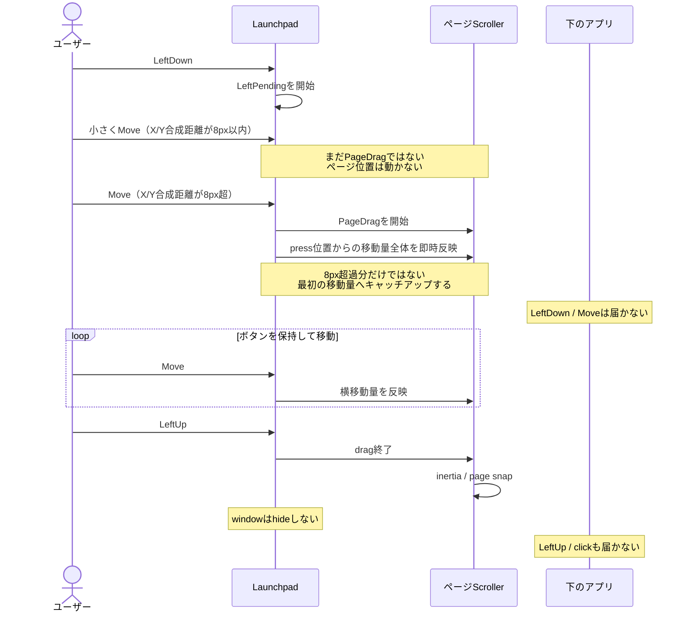
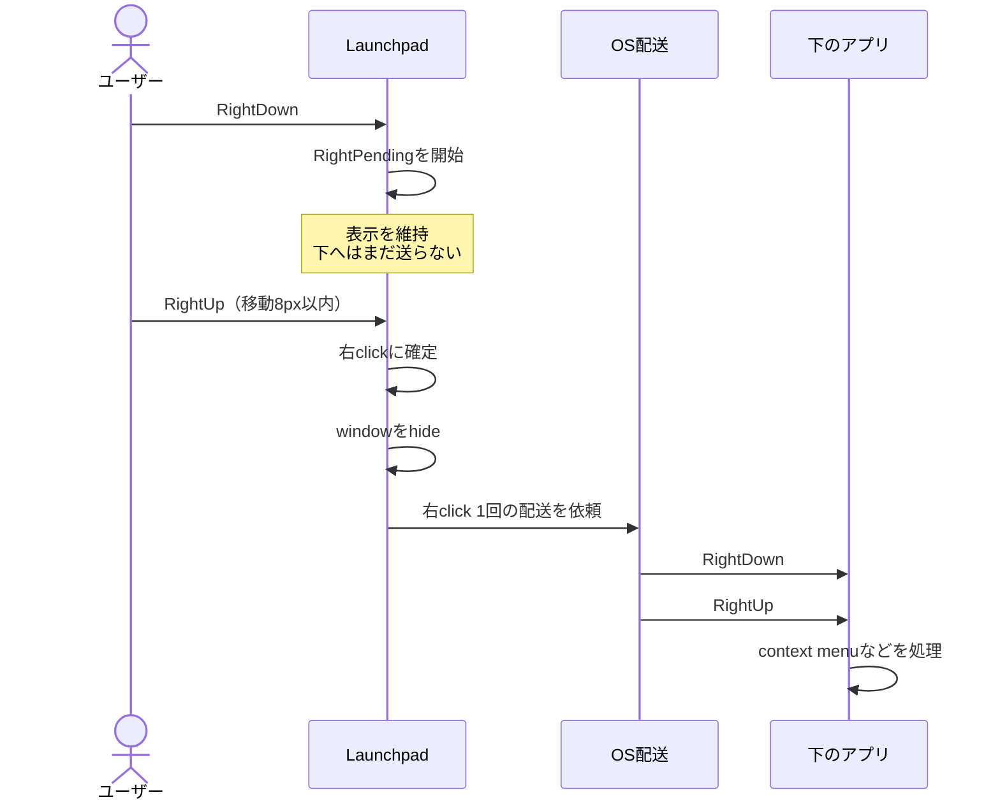
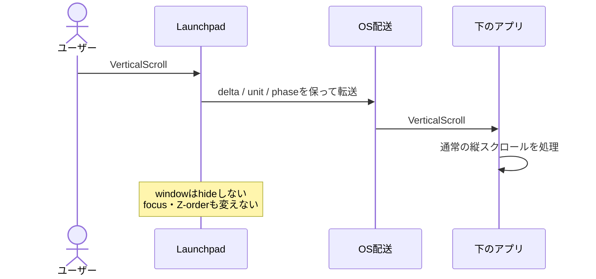
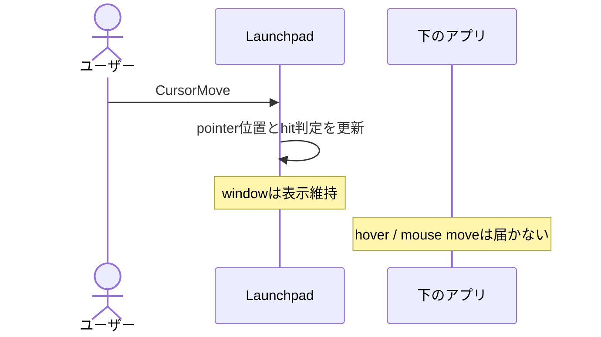

# ページフレーム外入力ルーティング要件

Status: Draft 0.5

基準実装: `main` (`9e99f11`, v0.0.14)

## 目的

Launchpad の通常表示中、ページフレーム Liquid Glass の外側にある透明領域で、
入力種別とジェスチャーに応じて次の動作を実現する。

- 左の単発クリック: 下のアプリへ 1 クリックを届け、Launchpad を隠す。
- 左ドラッグ: 下へ届けず、Launchpad のアプリ一覧を横スクロールする。
- 右の単発クリック: 下のアプリへ 1 クリックを届け、Launchpad を隠す。
- 右ドラッグ: 下へ届けず、何も発火させずにキャンセルする。
- 縦スクロール: 下のアプリへ届け、Launchpad は表示を維持する。
- ホバー: 下のアプリへ届けず、Launchpad が表示されている間は抑止する。

Windows と macOS で、ユーザーから見た意味を揃える。

左右どちらのクリックでも、Launchpad を隠すタイミングは button down の瞬間では
なく、対応する button up、つまりユーザーがボタンを離した瞬間とする。

この文書では「Launchpad を閉じる」を、常駐プロセスを終了または再起動すること
ではなく、既存の Launchpad ウィンドウを `hide` することと定義する。次回 summon
では同じプロセスとウィンドウライフサイクルを再利用する。

## 設計上の基準

現在の作業ブランチにある click / wheel 転送コードは要件の基準にしない。
特に、入力後に Launchpad が終了・再起動したように見える挙動、Z-order の往復、
summon 用 focus grace の流用には依存しない。

入力とページドラッグの基準は `main` にある次の流れとする。

1. 左 press を `PendingPress` として保留する。
2. click slop 内の release はクリックとして解決する。
3. slop を超える移動は既存のページドラッグへ昇格する。
4. ドラッグ終了後は既存の inertia / snap を使う。

この文書の「アプリ一覧を横スクロールする」は、新しい操作を追加する意味ではなく、
`main` に既にある左右のページドラッグをそのまま継続することを指す。

外側の左ドラッグを Launchpad が処理する必要があるため、透明領域全体を常時
OS の input-transparent region にする方式は採用できない。少なくとも左 press は
Launchpad が受け取り、click と drag の intent が確定するまで所有する。

## 用語

### Launchpad 所有領域

Launchpad がクリック、ドラッグ、スクロールを処理すべき領域。

- ページフレーム Liquid Glass の SDF 内部
- 下部コントロールと、その表示中の追加ボタン
- 開いているフォルダと modal backdrop
- 開いている設定パネルと modal backdrop
- 編集、ドラッグ、開閉アニメーション中の viewport

### 外側透明領域

通常表示の viewport から Launchpad 所有領域を除いた領域。

見た目の alpha から推測せず、描画と同じレイアウト geometry から判定する。
ページフレームの角丸部分も描画と同じ SDF 境界を使う。

### 下のアプリ

ポインターの screen 座標において、Launchpad の直下で OS の通常のヒットテスト
対象となるウィンドウまたはコントロール。ブラウザーやエディター内の scroll
surface など、必要な場合は child window まで含む。

## 外側透明領域の機能要件

### R1. 左 press の保留

外側透明領域で左ボタンが押された時点では、下のアプリへ down を配送せず、
Launchpad も隠さない。`LeftPending` として次を保持する。

- press 時刻
- press の screen 座標と Launchpad local 座標
- 現在の pointer 座標
- pointer 移動量
- press 時点の hit classification

保留中は click か page drag のどちらか一方だけに解決する。両方を発火させない。

### R2. 左の単発クリック

`LeftPending` が click slop を超えずに release された場合:

1. left button up を受けた瞬間に単発クリックとして確定する。
2. button up より前には Launchpad を隠さない。
3. click 確定後、Launchpad ウィンドウを隠す。
4. 下のアプリへ完全な左クリック 1 回を届ける。
5. Launchpad のページドラッグ、アプリ起動、編集モードを発火させない。
6. down の欠落、up だけの配送、二重配送を起こさない。
7. Launchpad の常駐プロセスを終了・再起動しない。

クリックを届けた結果、下のアプリがアクティブになるかどうかは OS の通常の
左クリック動作に従う。

外側での静止した長押しは編集モードへ入らない。slop 内で release された場合は、
通常の左クリックとして扱う。

### R3. 左ドラッグによるアプリ一覧スクロール

`LeftPending` の移動量が click slop を超えた場合:

1. `main` と同じく、X/Y の合成移動距離が 8 physical px を超えた時点で
   intent を `PageDrag` に確定する。
2. 8 physical px 以内ではページ位置を変更しない。
3. press の開始位置を anchor として、`main` と同じページドラッグを開始する。
4. 閾値を超えた最初の move event で、8 px の超過分だけではなく、press anchor
   から現在位置までの水平方向移動量全体をページ位置へ即時反映する。
5. 昇格後は水平方向の移動量でアプリ一覧をポインターへ直接追従させる。
6. release 後は既存の velocity、inertia、rubber-band、page snap を使う。
7. down、move、up、click のいずれも下のアプリへ配送しない。
8. Launchpad を隠さず、表示を維持する。
9. drag 中に pointer がページフレーム内へ入っても ownership を変更しない。
10. 1 gesture の途中で `LeftPending` または click へ戻さない。

外側 drag が始まった時点で、下のアプリに文字選択、ウィンドウ移動、範囲選択、
ドラッグ&ドロップなどを開始させてはならない。

内部では 8 physical px の intent 判定を維持するが、昇格時に開始位置からの移動量
全体へ追いつくため、ユーザーからはページが指の移動へ素直に追従し、恒久的な
8 px のずれや知覚できるデッドゾーンが残らないこと。

### R4. 右クリック

外側透明領域の右ボタン操作は、右の単発クリックかキャンセルのどちらかに解決する。

1. right button down では Launchpad を隠さず、下のアプリへも配送しない。
2. right button down から解決までは `RightPending` として、press 位置と移動量を
   app 層で保持する。
3. X/Y の合成移動距離が 8 physical px 以内で right button up された場合、
   その button up の瞬間に右の単発クリックとして確定する。
4. 右クリック確定後に Launchpad ウィンドウを隠し、下のアプリへ完全な
   right down / right up を 1 組だけ届ける。
5. down の欠落、up だけの配送、二重配送を起こさない。
6. X/Y の合成移動距離が 8 physical px を超えた時点で、右クリック候補を
   キャンセルする。
7. キャンセル後は right down、move、right up、click のいずれも下へ届けず、
   Launchpad も隠さない。
8. 右ボタン移動を Launchpad のページドラッグ、アプリ起動、編集モードとして
   発火させない。
9. Launchpad の常駐プロセスを終了・再起動しない。

右ドラッグは本要件では非対応とする。右ボタンを押したまま 8 physical px を超えて
移動した操作は、下のアプリにも Launchpad のページ操作にも影響しない。

### R5. 縦スクロール

pointer が外側透明領域にある間の縦スクロールは:

1. pointer 位置の下にあるアプリへ届く。
2. Launchpad を隠さず、表示を維持する。
3. Launchpad のプロセス、ウィンドウ、renderer を再作成しない。
4. Launchpad の focus、Z-order、topmost 属性を転送のために変更しない。
5. 1 回の物理入力から複数の配送や自己再入を起こさない。
6. `LineDelta` は line 単位、`PixelDelta` は pixel 単位のまま扱う。
7. precision touchpad / trackpad の小さい delta、方向、連続性を失わない。
8. 取得できる場合は began / changed / ended と momentum phase を維持する。

縦スクロールは左ボタンの `LeftPending` や `PageDrag` とは独立した入力である。
左ボタンを保持中、ページドラッグ中、モーダル表示中、編集モード中は下へ
転送しない。

横スクロールの転送は本ドラフトの対象外とする。

### R6. ホバー

Launchpad が表示され、pointer が外側透明領域にある間の cursor move / hover は:

1. 下のアプリへ転送しない。
2. 下のアプリの hover 表示、tooltip、animation、選択候補を反応させない。
3. Launchpad 自身の pointer 位置、hit classification、gesture 判定には使用する。
4. `LeftPending`、`PageDrag`、`RightPending` 中も下へ転送しない。
5. Launchpad が hide された後は OS の通常配送へ戻し、hover を合成して再生しない。

## Launchpad 所有領域の要件

### R7. 通常表示

- ページフレーム内の左右クリックは Launchpad が処理する。
- ページフレーム内の縦スクロールは下へ転送しない。
- 下部コントロール上の左右クリックは Launchpad が処理する。
- 下部コントロール上の縦スクロールは下へ転送しない。
- 角丸 bounding box 内でも SDF 上フレーム外なら外側透明領域とする。
- DPI、Retina、resize、ページ数、現在ページが変わっても、描画境界と
  入力境界を一致させる。

### R8. フォルダ・設定・編集・ドラッグ

次の状態では viewport 全体を Launchpad 所有領域とする。

- フォルダの open / opening / closing
- 設定パネルの open / opening / closing
- 編集モード
- アイコン drag
- ページ drag
- pointer gesture の ownership が確定するまでの `LeftPending`
- pointer gesture の ownership が確定するまでの `RightPending`

この間は:

- modal backdrop のクリックは modal を閉じるだけで、下へ配送しない。
- 左右クリックと縦スクロールを下へ配送しない。
- gesture の途中で下のアプリへ ownership を移さない。

## ライフサイクルとフォーカス

### R9. 「閉じる」の正確な意味

外側の左単発クリックまたは右クリック後:

- 対応する button up を受けるまではウィンドウを表示したままにする。
- button up の瞬間にクリックを確定し、その確定処理で hide する。
- Launchpad ウィンドウを hide する。
- プロセス ID は変わらない。
- tray、global hotkey、cache、renderer の常駐状態を維持する。
- 次回 summon で同じ常駐プロセスを表示する。
- 新しい Launchpad プロセスを起動しない。
- window / renderer の不要な再初期化を行わない。

外側の左ドラッグ、キャンセルされた右ドラッグ、または縦スクロール後:

- Launchpad ウィンドウを hide しない。
- focus-loss hide を誤発火させない。
- Z-order を背面へ落とさない。
- summon 用 grace period を入力転送のガードとして流用しない。

### R10. 配送失敗

- 対象なし、権限拒否、配送失敗を成功として記録しない。
- 失敗時も自己再入、focus loop、Z-order 破損、プロセス再起動を起こさない。
- Windows では `SendInput` の UIPI 制限を構造化された失敗として扱う。
- macOS で権限が必要な fallback を使う場合は、許可状態と失敗理由を検出する。

## スイムレーン図

### ケース1: 外側で左ボタンを単発クリック

### ケース2: 外側から左ドラッグ

### ケース3: 外側で右ボタンを単発クリック

### ケース4: 外側で縦スクロール

### ケース5: 外側でホバー

## 状態別入力マトリクス

| 状態 | 場所 | 左クリック | 左ドラッグ | 右クリック | 縦スクロール | ホバー |
| --- | --- | --- | --- | --- | --- | --- |
| 通常 | ページフレーム内 | Launchpad | ページ操作 | Launchpad | 転送しない | Launchpad |
| 通常 | 下部コントロール | Launchpad | Launchpad | Launchpad | 転送しない | Launchpad |
| 通常 | 外側透明領域 | 下へ1回、hide | 一覧を横scroll、表示維持 | 8px以内で下へ1回、hide | 下へ、表示維持 | Launchpadのみ |
| `LeftPending` | 任意 | 判定待ち | 8px超過でPageDrag | 転送しない | 転送しない | 下へ転送しない |
| `PageDrag` | 任意 | 発火しない | Launchpadが継続所有 | 転送しない | 転送しない | 下へ転送しない |
| `RightPending` | 任意 | 転送しない | 転送しない | 8px以内Upでclick、8px超でcancel | 転送しない | 下へ転送しない |
| フォルダ表示中 | 任意 | folder/modal操作 | folder操作 | folder/modal操作 | 転送しない | Launchpad |
| 設定表示中 | 任意 | settings/modal操作 | settings操作 | settings/modal操作 | 転送しない | Launchpad |
| 編集中 | 任意 | edit操作 | edit操作 | edit操作 | 転送しない | Launchpad |
| 非表示 | 任意 | OSが通常配送 | OSが通常配送 | OSが通常配送 | OSが通常配送 | OSが通常配送 |

## アーキテクチャ要件

- `layout / ui_model` が `LaunchpadOwned`、`OutsideTransparent`、
  `ModalDismiss` を描画と同じ geometry から分類する。
- raw `WindowEvent` の handler は OS API を直接呼ばない。
- app 層が button、hit target、gesture phase、ownership を決める。
- `LeftPending` と `PageDrag` は platform 層ではなく app 層に置く。
- `RightPending` も app 層に置き、press 位置と移動量を保持する。
- `RightPending` の判定中は platform 層を呼ばず、ウィンドウを表示したままにする。
- 8 physical px 以内の right up で確定した場合だけ、hide 後に完全な右クリックを
  platform 層へ依頼する。
- 8 physical px を超えた場合は `RightPending` をキャンセルし、下へ配送しない。
- 表示中の外側 cursor move / hover は platform 層へ配送しない。
- platform 層は確定済みの click / right-click / vertical scroll の配送だけを担う。
- platform 層は `Delivered`、`NoTarget`、`PermissionDenied`、
  `Unsupported`、`Failed` のような結果を返す。
- Windows と macOS の差分を app の gesture state machine へ漏らさない。
- 合成入力を使う場合は注入イベントを識別し、Launchpad 自身では再転送しない。
- OS API が入力を queue へ追加するだけなら、API の戻り時点で対象に同期配送済み
  とは仮定しない。

## 実装方針の仮説

### 共通

`main` の `PendingPress -> page drag` を残し、外側の左 release だけを
`hide -> left click delivery` へ分岐する。右ボタンは独立した action と command
を追加し、`RightPending` から単発クリックまたはキャンセルへ解決する。wheel も
独立 command とし、click / drag の state を共有しない。hover は表示中には
下へ転送しない。

### Windows

- 左単発クリック: Launchpad を hide した後、完全な left down / up を配送する。
- 右クリック: 8 physical px 以内の物理 right up で確定し、Launchpad を hide
  した後に完全な right down / up を配送する。
- 右ドラッグ: 8 physical px 超過でキャンセルし、OS 転送も hide も行わない。
- 左ドラッグ: `main` の scroller をそのまま使用し、OS 転送を行わない。
- 縦スクロール: Launchpad の visibility、focus、Z-order を変えずに、pointer
  直下の実際の scroll target へ届ける方式を技術検証する。
- ホバー: Launchpad 表示中は下へ転送しない。

`HTTRANSPARENT` 単独は、Microsoft の仕様上、同一 thread の下位 window への
継続配送であり、別プロセスへの一般的なパススルー手段とは仮定しない。
Launchpad を `HWND_BOTTOM` へ往復させる方式は採用しない。

### macOS

- 左単発クリック: Launchpad を hide した後、完全な left click を配送する。
- 右クリック: 8 physical px 以内の物理 right up で確定し、Launchpad を hide
  した後に完全な right down / up を配送する。
- 右ドラッグ: 8 physical px 超過でキャンセルし、OS 転送も hide も行わない。
- 左ドラッグ: `main` の scroller をそのまま使用し、OS 転送を行わない。
- 縦スクロール: 表示中の Launchpad 自身へ戻らず、pixel / momentum 情報を
  保ったまま pointer 直下へ届ける方式を技術検証する。
- ホバー: Launchpad 表示中は下へ転送しない。

`NSWindow.ignoresMouseEvents` は window 全体の切り替えなので、左 drag の判定が
必要な今回の通常状態では、常時 `true` にする方式は使わない。

## 観測性

デバッグ時は最低限、次を記録する。

- OS、button / wheel、line / pixel 単位、delta、phase
- pointer の screen / local 座標と hit target
- `LeftPending` の開始、slop 超過、`PageDrag` 昇格、release
- `RightPending` の開始、移動量、click 確定またはキャンセル、right up、hide
- normal / modal / edit / drag の ownership
- native delivery / synthetic fallback
- 配送結果と失敗理由
- 注入イベントを自己再入として破棄した回数
- hide 前後の PID、window identity、visible state

通常運用では wheel 1 event ごとの無制限ログを出さない。

## 現在の作業ブランチで観測された問題

この節は修正対象の把握用であり、要件または設計の基準ではない。

1. Windows wheel 転送が Launchpad を `HWND_BOTTOM` へ移動し、`SendInput`
   直後に戻しているため、非同期配送と自己再入の競合を持つ。
2. Z-order 変更と summon 用 focus grace の流用により、本来の focus loss を
   一時的に無視し得る。
3. macOS wheel 合成は表示中の Launchpad 自身が合成 event を再受信する経路を持つ。
4. `PixelDelta / 40` と整数 line への丸めで precision scroll が失われる。
5. wheel 判定が modal、edit、control の ownership を表現していない。
6. click / scroll 後に Launchpad の window または process lifecycle が乱れ、
   終了・再起動したように見える。
7. pure unit test は通るが、自己再入、focus、Z-order、PID 維持を検証する
   OS integration test がない。

## 受け入れテスト

### 左単発クリック

1. 外側で left down したまま保持している間は Launchpad が表示され続ける。
2. left up の瞬間に Launchpad が hide される。
3. 下の Notepad / TextEdit の caret が 1 回だけ移動する。
4. PID、tray、global hotkey は維持され、次の summon で同じプロセスが戻る。
5. 下のアプリにも Launchpad にも二重 click が発生しない。

### 左ドラッグ

1. 外側で left down し、8 physical px 以内の移動ではページ位置が変わらない。
2. 閾値を超えた最初の move で、press 位置からの移動量全体へページ位置が
   キャッチアップし、その後は pointer に追従する。
3. 昇格後に恒久的な 8 px のずれや、知覚できる引っ掛かりが残らない。
4. release 後に既存の inertia / snap でページが確定する。
5. Launchpad は表示されたままである。
6. 下のエディターで文字選択、下のウィンドウで移動や drag が開始されない。
7. drag の途中でページフレーム内へ入っても同じ gesture が継続する。
8. release 時に下のアプリへ click が漏れない。

### 右クリック

1. 外側で right down したまま保持している間は Launchpad が表示され続ける。
2. right down 中は下のアプリへ right down / move を届けない。
3. 移動が 8 physical px 以内なら、right up の瞬間にクリックとして確定し、
   Launchpad が hide される。
4. 確定後、下のアプリが完全な right down / right up を各 1 回だけ受け取る。
5. 静止した right click では context menu が 1 回だけ開く。
6. 移動が 8 physical px を超えた場合はキャンセルし、下へ right down / move /
   right up / click のいずれも届けず、Launchpad も hide しない。
7. PID、tray、global hotkey は維持される。
8. 右ボタン移動を Launchpad のページ drag として扱わない。

### ホバー

1. Launchpad 表示中に外側を cursor move しても、下のアプリの hover 表示、
   tooltip、animation が反応しない。
2. `LeftPending`、`PageDrag`、`RightPending` 中も下のアプリへ hover が漏れない。
3. 左または右の単発クリックで Launchpad が hide された後は、次の物理的な
   cursor move から下のアプリが OS の通常 hover を受け取る。
4. hide 時に過去の hover / mouse move を合成して再生しない。

### 縦スクロール

1. 外側から Chromium、Firefox、エディターを mouse wheel で上下 scroll できる。
2. precision touchpad / trackpad の小さい delta と momentum が欠落しない。
3. Launchpad は表示されたままで、PID、window identity、Z-order が変化しない。
4. scroll 後にフレーム内 app を 1 click で起動できる。
5. scroll 後に外側 left / right click の button up で hide できる。

### 所有状態と境界

1. 下部 control 上の click / wheel が下へ届かない。
2. folder、settings、edit の各状態で backdrop の click / wheel が下へ届かない。
3. 角丸の内外 1 px、100% / 125% / 150% / 200% scale を確認する。
4. 複数 monitor と負の screen 座標を確認する。
5. 外側と所有領域をまたぐ press / drag / release で二重動作しない。

### OS 固有

Windows:

- 通常権限と管理者権限の target を分け、UIPI 制限時の結果を確認する。
- 非アクティブ window scroll の OS 設定を on / off の両方で確認する。
- always-on-top、taskbar、複数 monitor で Z-order が変化しない。

macOS:

- mouse、Magic Mouse、trackpad の pixel / momentum scroll を確認する。
- Accessibility 許可なし / ありを分け、必要な場合だけ案内する。
- 複数 display、Spaces、fullscreen app 上で確認する。

## 確定事項

- drag 昇格条件は `main` のまま、X/Y 合成移動距離が 8 physical px を超えた時点。
- 左 drag 昇格時は press anchor からの移動量全体を同じ event で反映する。
- right button は `RightPending` で保留し、8 physical px 以内の right up だけを
  完全な右クリックとして下へ届けて hide する。
- right button の移動が 8 physical px を超えた場合はキャンセルし、下へ届けず
  Launchpad も hide しない。
- Launchpad 表示中の外側 hover / mouse move は下へ転送しない。

## 確認が必要な点

1. 外側で左 press し、slop 内のままフレーム内で release した場合は、
   click を下へ届けず何もしない、でよいか。
2. 外側の横 wheel / trackpad scroll は明示的に無視でよいか。
3. desktop 上の外側 left / right click でも Launchpad を hide するか。
4. Windows の管理者権限アプリへ届かない場合、OS 制限として許容するか。
5. macOS で権限が必要な synthetic fallback は許容するか。

## 参考仕様

- Microsoft: [WM_NCHITTEST message](https://learn.microsoft.com/en-us/windows/win32/inputdev/wm-nchittest)
- Microsoft: [SendInput function](https://learn.microsoft.com/en-us/windows/win32/api/winuser/nf-winuser-sendinput)
- Apple: [NSWindow.ignoresMouseEvents](https://developer.apple.com/documentation/appkit/nswindow/ignoresmouseevents)
- Apple: [NSWindow.windowNumber(at:belowWindowWithWindowNumber:)](https://developer.apple.com/documentation/appkit/nswindow/windownumber%28at%3Abelowwindowwithwindownumber%3A%29)
- Apple: [CGEvent.post(tap:)](https://developer.apple.com/documentation/coregraphics/cgevent/post%28tap%3A%29)
- Apple: [AXIsProcessTrustedWithOptions](https://developer.apple.com/documentation/applicationservices/1459186-axisprocesstrustedwithoptions)
