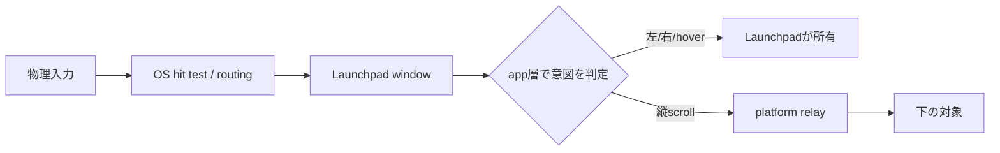
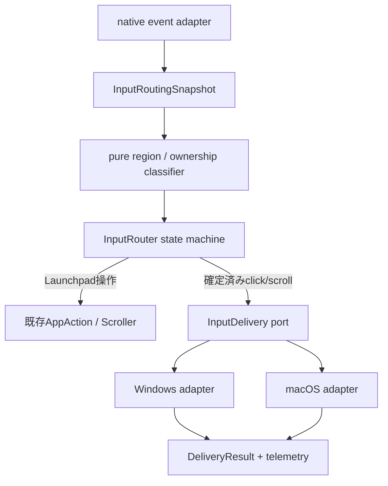
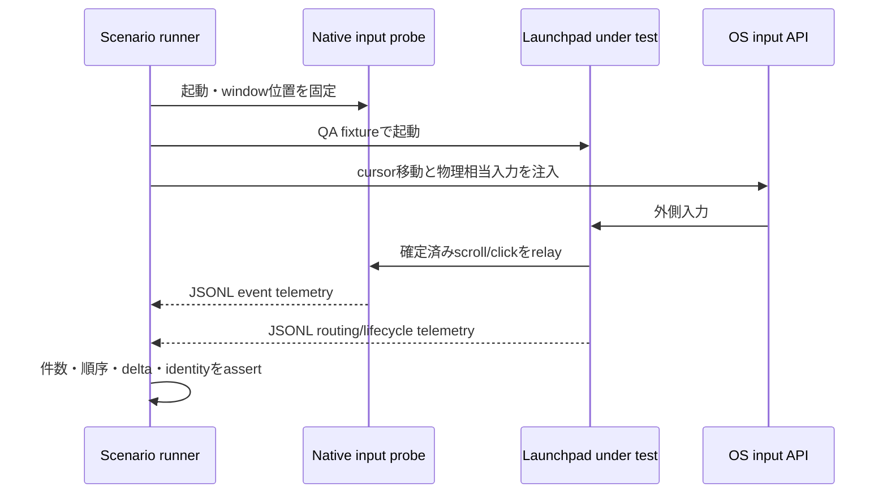

# ページフレーム外入力ルーティング 技術調査・検証計画

- Status: Research draft 0.1
- 調査日: 2026-07-26
- 要件: [INPUT_PASSTHROUGH_REQUIREMENTS.md](INPUT_PASSTHROUGH_REQUIREMENTS.md)
- 実装基準: `main` の入力状態機械。現在の `vertical-scroll-passthrough` ブランチは
  失敗事例と技術スパイクとしてのみ参照する。

## 結論

今回の要件は、単純な「透明ウィンドウ」設定だけでは実現できない。

同じ外側透明領域で、左・右ボタンと hover は Launchpad が所有する一方、縦
スクロールだけは別プロセスへ渡す必要がある。通常の OS hit test は入力種別ごとに
所有者を分けないため、Launchpad が表示されたままの状態で明示的な scroll relay が
必要になる。

推奨方針は次のとおり。

1. gesture の意味と状態遷移は `main` を基準に app 層で決定する。
2. 外側判定は描画と共有する純粋な geometry classifier に一本化する。
3. 縦スクロールはウィンドウの visibility、focus、Z-order を変えず、OS ごとの
   native event を下の対象へ明示的に relay する。
4. Windows はまず、元の `WM_MOUSEWHEEL` の値を保持したまま、Z-order を
   読み取り専用で探索して得た対象 HWND へ配送する方式を検証する。
5. macOS は、元の `NSEvent` / `CGEvent` をコピーし、Launchpad より下の window
   owner PID へ `CGEventPostToPid` する方式を検証する。
6. 実装より先に native input probe と自動シナリオ runner を作り、配送数、
   delta、phase、focus、Z-order、PID を機械判定する。

現在ブランチの `HWND_BOTTOM -> SendInput -> Z-order復元` は採用しない。
Microsoft の仕様上、topmost window を `HWND_BOTTOM` へ移すと topmost 状態を失う。
また `SetWindowPos` は window position 関連 message を発生させ得るため、現在見えて
いる focus-loss guard や summon grace の流用は、配送機構が lifecycle を壊している
ことへの対症療法になっている。

## 調査範囲と前提

### 正とするもの

- `main` の `PendingPress -> PageDrag`。
- X/Y 合成距離が 8 physical px を超えたら drag に昇格する。
- 昇格 event で press anchor から現在位置までの移動量全体を scroller へ反映する。
- window を閉じるとは process 終了ではなく既存 window の `hide` である。
- [入力ルーティング要件](INPUT_PASSTHROUGH_REQUIREMENTS.md) Draft 0.5。

### 現在ブランチから活かせる可能性があるもの

- 外側 geometry 判定を event 処理から分離しようとしている部分。
- Windows で launcher より下の top-level window を Z-order walk する着想。
- `SendInput` / `CGEvent` の戻り値や失敗を構造化しようとした platform 境界。
- synthetic input の自己再入が問題になる、という観測結果。

### 現在ブランチから引き継がないもの

- wheel のたびに Launchpad を `HWND_BOTTOM` へ移動して戻すこと。
- wheel relay の副作用を `forwarding_wheel` や `SUMMON_FOCUS_GRACE` で隠すこと。
- `PixelDelta / 40`、整数 line への丸め。
- 表示中の Launchpad が受け取る system-wide synthetic event を、そのまま下へ
  届くと仮定すること。
- PostMessage 方式が一度動かなかった、または SendInput 方式が一部で動いたことを
  一般解とみなすこと。

## OS 仕様から分かる制約

### 共通の本質



Launchpad window が全画面を覆って入力を受ける以上、OS の通常 routing はまず
Launchpad を対象にする。scroll だけを下へ渡すには `Relay` が必要になる。

### Windows

#### wheel は単なる「cursor 下の window message」ではない

Microsoft の `WM_MOUSEWHEEL` 仕様は、wheel message を focus window へ送り、
未処理なら `DefWindowProc` が parent chain へ伝播すると定義している。delta は
`WHEEL_DELTA = 120` の倍数だけに限定されず、高分解能 wheel の小さい値を蓄積または
部分 scroll として処理できる。

Windows 10 以降には `SPI_GETMOUSEWHEELROUTING` があり、設定値 2
`MOUSEWHEEL_ROUTING_MOUSE_POS` では cursor 下の app へ routing される。一方、
focus routing 設定も存在する。したがって、常に `SendInput(MOUSEEVENTF_WHEEL)` を
呼べば目的の app へ行く、とは仮定できない。

#### hit test API だけでは overlay を飛び越えられない

`WindowFromPoint` は指定点の window を返すが、Launchpad 自身がその点を覆って
いれば Launchpad を返す。`ChildWindowFromPointEx` は immediate child だけを探索
するため、deep child を探すには再帰が必要になる。

`WM_NCHITTEST` の `HTTRANSPARENT` は、仕様上「同じ thread」の下位 window への
継続 hit test であり、別プロセスへの一般的な pass-through ではない。

また `WS_EX_TRANSPARENT` の公式な意味は、同一 thread の sibling が先に描画される
paint ordering である。入力透過を保証する style として扱ってはいけない。

#### injection と直接 message の差

`SendInput` は mouse input stream へ event を直列挿入するが、対象 HWND を指定
できない。さらに UIPI により同等以下の integrity level にしか注入できず、UIPI
による失敗は return value や `GetLastError` から明確に区別できない。

`PostMessageW` は対象 HWND の queue を指定でき、呼び出し元を block しないが、
成功は「queue へ追加できた」ことまでしか示さない。UIPI で拒否された場合は
`ERROR_ACCESS_DENIED` を取得できる。

`SendMessageTimeoutW` は処理完了または timeout を観測できるが、外部 app の
window procedure を待つため、high-rate scroll を UI thread から同期配送する用途
には向かない。互換性調査または限定 fallback に留める。

### macOS

#### window と event の routing

AppKit は mouse event を hit した window/view へ配送する。`NSWindow` の
`ignoresMouseEvents` は window 全体を mouse-transparent にする設定であり、今回の
ように同じ window で外側 left drag と button intent を所有する通常状態には
使えない。

`NSWindow.windowNumber(at:belowWindowWithWindowNumber:)` は、指定 window より
Z-order が下で、その点の mouse-down hit test 対象となる frontmost window number
を返す。別 app の window number も返せる。`CGWindowListCopyWindowInfo` と
`kCGWindowOwnerPID` を組み合わせれば、その window の owner PID を得られる。

#### 元 event を保持する価値

`NSEvent` は `scrollingDeltaX/Y`、`hasPreciseScrollingDeltas`、gesture `phase`、
`momentumPhase` を持つ。trackpad の momentum event は最初に hit した view へ
連続配送されるため、gesture 中に target を毎回変更せず、開始時の target を
保持する必要がある。

Core Graphics の `CGEvent` は低レベル event を表し、`postToPid` で指定 process
へ送れる。元の `NSEvent.cgEvent` をコピーして送れば、winit の
`LineDelta / PixelDelta` から scroll event を再構築するより、raw delta、
precise delta、scroll phase、momentum phase を保持しやすい。

event posting の可否は `CGPreflightPostEventAccess` で事前確認できる。権限が
必要な構成では、起動時に無条件で prompt を出さず、機能を初めて必要とした時点で
明示的に案内する。

## 推奨アーキテクチャ

### 責務分離



#### `InputRoutingSnapshot`

native callback から安全に参照できる immutable snapshot とする。

- window visible / hidden
- viewport と scale factor
- page frame geometry と corner radius
- bottom control geometry
- folder / settings / edit / icon drag / page drag
- `LeftPending` / `RightPending`
- pointer screen / local 座標変換に必要な window origin
- routing generation

app は状態変更時に snapshot を置き換える。native callback は app の mutable state
や renderer を直接触らない。

#### `InputRouter`

`main` の gesture semantics を保つ純粋な状態機械とする。

- `Idle`
- `LeftPending`
- `PageDrag`
- `RightPending`
- modal / edit / icon drag による全領域 ownership

platform API の成否で gesture の意味を変えない。例えば wheel delivery が失敗しても
click に化けたり、window を hide したりしない。

#### `InputDelivery`

platform 層に渡す request は、winit event の断片ではなく意味の確定した packet に
する。

```text
DeliverLeftClick { screen_point, generation }
DeliverRightClick { screen_point, generation }
DeliverVerticalScroll { native_event, target_lock, generation }
```

戻り値:

```text
Delivered
Queued
NoTarget
PermissionDenied
TargetHung
Unsupported
Failed { os_error }
```

`Queued` と `Delivered` を混同しない。OS API の return が queue insertion だけを
示す場合は `Queued` とする。

## Windows 実現案

### 推奨する最初のスパイク

1. winit の `EventLoopBuilderExtWindows::with_msg_hook` で `MSG` を
   `DispatchMessage` 前に観測する。
2. `WM_MOUSEWHEEL` の元の `wParam / lParam` を保持する。
3. `InputRoutingSnapshot` で外側かつ wheel relay 可能な状態か判定する。
4. Launchpad HWND の次から `GetWindow(GW_HWNDNEXT)` で Z-order を読み取り専用探索
   し、screen point を含む最初の visible / uncloaked top-level window を得る。
5. 対象 top-level 内を `ChildWindowFromPointEx` で再帰探索し、deepest
   hit-testable child を候補にする。
6. 元の `WM_MOUSEWHEEL` を `PostMessageW` で候補 HWND へ queue する。
7. queue 成功時だけ元 message を consume する。`NoTarget` や配送失敗時の扱いは
   明示的な policy とし、Launchpad 自身の page scroll には流さない。

この方式の利点:

- visibility、focus、Z-order を変更しない。
- `WHEEL_DELTA` 未満の高分解能 delta と modifier flags を保持できる。
- `SendInput` の自己再入がない。
- PostMessage の UIPI 拒否を構造化できる。
- UI thread が下の app の処理完了を待たない。

注意点:

- 直接 `WM_MOUSEWHEEL` を受けない framework / control が存在し得る。
- top-level が処理する app と child が処理する app の両方がある。
- queue 成功は画面が scroll した証明ではない。
- gesture の target は wheel sequence の開始時に lock し、途中で cursor が少し
  動いても同じ target を使う必要がある。

このため、次節の probe で少なくとも top-level Win32、nested child、Chromium /
Electron の実測を行い、target selection を決める。deepest child だけで不足する
場合は、`child -> parent` の候補 chain を生成し、probe による framework profile
で配送先を決める。1 event を複数候補へ broadcast してはならない。

### 第二候補

`SendMessageTimeoutW(SMTO_ABORTIFHUNG | SMTO_ERRORONEXIT)` を短い timeout で使う
方式は、message が処理されたかを確認したい compatibility spike として比較する。
本番採用する場合は専用の ordered dispatcher が必要であり、UI thread から直接
待たない。

### 採用しない方式

| 方式 | 判断 | 理由 |
| --- | --- | --- |
| `HWND_BOTTOM -> SendInput -> 復元` | 不採用 | topmost、focus、Z-order、非同期配送が競合する |
| wheel のたびに hide / show | 不採用 | 要件違反。capture と lifecycle も乱す |
| 表示中に単純 `SendInput(WHEEL)` | 不採用 | target 指定不可。Launchpad が再受信し得る |
| `HTTRANSPARENT` だけ | 不採用 | cross-process pass-through の保証がない |
| `WS_EX_TRANSPARENT` だけ | 不採用 | 公式には paint ordering の意味 |
| UI Automation `ScrollPattern` | primary には不採用 | 全 app 共通でなく、raw delta / momentum と意味が異なる |
| `WH_MOUSE_LL` で全 mouse を常時 filter | first choice には不採用 | dedicated loop、timeout、hook 脱落監視が必要 |

`WH_MOUSE_LL` は、直接 message relay の compatibility が受け入れ基準を満たさない
場合に限り、window architecture の再設計とセットで再検討する。Microsoft は
low-level hook callback を短時間で返すこと、専用 thread から処理を委譲することを
推奨し、timeout 時には hook が通知なしで外され得ると説明している。

## macOS 実現案

### 推奨する最初のスパイク

1. `NSEvent.addLocalMonitorForEvents` 相当を app 起動時に登録し、Launchpad 宛ての
   `scrollWheel` を winit より前で観測する。
2. `InputRoutingSnapshot` で外側かつ relay 可能か判定する。
3. `NSWindow.windowNumber(at:belowWindowWithWindowNumber:)` で Launchpad より下の
   window number を得る。
4. `CGWindowListCopyWindowInfo` の `kCGWindowNumber` と `kCGWindowOwnerPID` から
   target PID を得る。
5. scroll gesture の began / mayBegin で target PID を lock し、ended /
   cancelled と momentum end まで保持する。
6. 元の `NSEvent.cgEvent` を copy し、routing generation を user data field に
   tag して `CGEventPostToPid(target_pid, event)` する。
7. local monitor から元 event を `nil` として返し、Launchpad / winit での二重処理を
   防ぐ。

この方式の利点:

- Launchpad window を表示したままにできる。
- Z-order と focus を変更しない。
- system-wide stream へ再投入せず、Launchpad 自身への自己再入を避けられる。
- 元 event の precise delta、phase、momentum を保持できる。
- hover と button は従来どおり Launchpad window が受けるため、下の app へ漏れない。

検証が必要な点:

- `CGEventPostToPid` に必要な Accessibility / Input Monitoring 権限。
- browser、AppKit、Catalyst、Electron での scroll target。
- Spaces / fullscreen / Stage Manager での below-window 解決。
- momentum sequence 中に target app / window が閉じた場合の cancel。
- synthetic event tag が target app で情報を損なわないこと。

### 採用しない方式

| 方式 | 判断 | 理由 |
| --- | --- | --- |
| system-wide `CGEvent.post(.cghidEventTap)` | 不採用 | 表示中の Launchpad が再び target になり得る |
| winit delta から line event を再生成 | 不採用 | precise delta、phase、momentum を失う |
| 通常時 `ignoresMouseEvents = true` | 不採用 | 外側 left drag、button intent、hover 抑止を所有できない |
| active global event tap を最初から使用 | first choice には不採用 | 権限と lifecycle が重く、local monitor で足りる可能性が高い |
| AX scroll action | primary には不採用 | raw scroll event と意味が違い、全 target で一様でない |

local monitor + `postToPid` で互換性が足りない場合のみ、active `CGEventTap` を
fallback として検討する。active filter は event を `NULL` で削除できるが、
Accessibility 権限、run loop、tap disabled の復旧が必要になる。

## Computer Use に依存しない検証

### 必要な新規コンポーネント



#### 1. Native input probe

製品とは別 process の小さい検証用 app を用意する。

Windows probe:

- top-level Win32 window
- nested child scroll surface
- `WM_MOUSEWHEEL`、`WM_POINTERWHEEL`
- left/right down/up、mouse move
- focus / activation
- HWND、thread ID、PID
- signed wheel delta、key state、screen coordinates
- monotonically increasing event serial

macOS probe:

- `NSWindow` + `NSScrollView`
- `NSEvent` type
- `scrollingDeltaX/Y`
- `hasPreciseScrollingDeltas`
- `phase` / `momentumPhase`
- mouse down/up/moved
- key/main window state
- window number、PID、event serial

probe は UI の見た目ではなく JSONL を named pipe / Unix domain socket で runner へ
返す。

#### 2. OS input generator

runner は Computer Use ではなく OS API で入力を生成する。

- Windows: `SendInput` で cursor move、button、wheel。
- macOS: test process から `CGEvent.post` で mouse / scroll。

製品の relay と異なる経路を使うことが重要である。

- Windows product candidate: targeted `PostMessageW`
- Windows test generator: `SendInput`
- macOS product candidate: `CGEventPostToPid`
- macOS test generator: session / HID event post

同じ関数を generator と product の両方に使うと、同じ誤りを共有して false positive
になり得る。

#### 3. Scenario runner

既存 `LAUNCHPAD_QA_SCENARIO` は app 内の action と GPU frame を決定論的に検証する
基盤であり、cross-process OS routing は検証していない。これを置き換えず、
`input-routing-qa` を別 harness として追加する。

runner の責務:

- probe と Launchpad の起動順を管理する。
- window rect と cursor point を固定する。
- test ごとに event log を reset する。
- 条件成立を polling し、固定 sleep に依存しない。
- timeout 時は両 process の JSONL と OS snapshot を artifact に残す。
- test 終了時に子 process を正常終了させる。

### 自動テストの層

#### Layer 1: pure unit tests

- geometry classifier の角丸内外、DPI、負の screen 座標。
- `LeftPending -> click / PageDrag`。
- drag 昇格 event で anchor からの全 displacement を反映。
- `RightPending -> click / cancel`。
- modal / edit / page drag 中の ownership。
- wheel target lock の begin / changed / ended / momentum。
- injected generation の自己再入拒否。
- delivery failure でも visibility と gesture state が壊れないこと。

#### Layer 2: platform contract tests

OS API を trait の外へ隔離し、fake window tree / event を使う。

- launcher より下の最初の対象を選ぶ。
- invisible、disabled、cloaked、透明 child を skip する。
- deepest child と parent candidate chain。
- negative coordinates と複数 display。
- target 消滅、permission denied、hung target。
- native delta / flags / phase を変換せず保持。

#### Layer 3: native end-to-end tests

最低限の受け入れ条件:

| Case | Probeでの期待 | Launchpadでの期待 |
| --- | --- | --- |
| 外側 left click | down/up 各1、up欠落なし | 物理upまでvisible、その後hide |
| 外側 left drag | mouse/button 0 | page drag、visible維持 |
| 外側 right click | down/up 各1 | 物理upでhide |
| 外側 right 8px超 | mouse/button 0 | cancel、visible維持 |
| 外側 vertical wheel | wheel event 1系列 | visible、focus、Z-order維持 |
| 外側 precise scroll | fractional/raw deltaとphase維持 | event欠落・重複なし |
| 外側 hover | mouse move 0 | pointer classifierのみ更新 |
| modal/edit中 wheel | wheel 0 | Launchpadが所有 |

全 case で次も assert する。

- Launchpad PID が変化しない。
- native window identity が変化しない。
- target PID / window identity が想定どおり。
- focus owner が scroll 前後で変化しない。
- Z-order snapshot が scroll 前後で変化しない。
- input 1回から relay が重複しない。
- timeout 後も次の gesture が正常に処理できる。

#### Layer 4: compatibility tests

native probe が通っても framework 差は残るため、次を別 matrix にする。

- Chromium / Edge の長い local test page
- Firefox の長い local test page
- VS Code / Electron
- Notepad または標準 native editor
- Windows の nested child control
- macOS AppKit `NSScrollView`

browser は remote debugging protocol で `scrollY` を取得できるため、画面認識や
Computer Use を使わずに検証できる。runner が browser を既知の位置へ起動し、
native wheel を注入して、CDP 等から scroll position の変化量を読む。

### CI 方針

通常 CI:

- pure unit tests
- platform adapter の compile test
- fake window tree の contract tests
- requirements matrix から生成した state-machine table test

専用 GUI runner:

- Windows native E2E
- macOS native E2E
- browser compatibility smoke

macOS の event posting / monitoring 権限は hosted runner で安定しない可能性がある。
Accessibility を明示的に許可した専用 runner で full E2E を実施し、通常 hosted CI
では permission-denied path までを検証する。

スクリーンショットはこの機能の合否判定には使用しない。既存 visual QA は見た目の
regression 用に残し、入力配送は event telemetry で判定する。

## 実装順序

### Phase 0: branch の扱いを固定

- `main` から新しい作業 branch を切る。
- 現在ブランチは比較・失敗事例として保存する。
- `HWND_BOTTOM`、wheel focus guard、delta 丸めを cherry-pick しない。

### Phase 1: pure router

- `InputRoutingSnapshot`
- region classifier
- `LeftPending / RightPending / PageDrag`
- `InputDelivery` trait
- delivery result
- unit tests

### Phase 2: probe first

- Windows native probe と runner
- macOS native probe と runner
- JSONL schema
- focus / Z-order / PID snapshot
- 失敗 artifact

この段階では product relay を実装せず、probe が物理相当入力を確実に記録できることを
確認する。

### Phase 3: Windows adapter spike

同一 probe に対して比較する。

1. `PostMessageW` + deepest child
2. `PostMessageW` + top-level
3. candidate chain を使った単一 target 選択
4. 必要な場合だけ `SendMessageTimeoutW`

合格条件を満たした方式だけ本実装へ入れる。Z-order を変更する方式は比較対象に
含めない。

### Phase 4: macOS adapter spike

1. local `NSEvent` monitor
2. below-window number -> owner PID
3. original `CGEvent` copy -> `postToPid`
4. target lock と momentum
5. permission preflight / failure path

### Phase 5: compatibility gate

- native probes
- Chromium / Firefox / Electron
- multiple monitor / negative coordinates
- Windows integrity mismatch
- macOS Spaces / fullscreen / permission states

## Go / No-Go 判定

Windows の targeted `WM_MOUSEWHEEL` relay は、native probe に加え Chromium、
Firefox、Electron、標準 editor の全対象で、重複なし・focus/Z-order不変を満たした
場合に Go とする。

満たさない場合は、個別 workaround を積み重ねず、window activation と keyboard
ownership を含む二層 window / no-activate architecture を別設計として再検討する。
その場合は global hook の信頼性、accessibility、IME、search field の keyboard
入力まで要件を拡張して判断する。

macOS の `postToPid` は precise delta と momentum phase を保持し、AppKit /
Chromium / Electron で target が一貫し、必要権限を製品要件として受け入れられる
場合に Go とする。権限なしで成立しない場合は、機能制限を明示するか、macOS の
window architecture 自体を見直す。

## 参考資料

### Microsoft

- [WM_MOUSEWHEEL message](https://learn.microsoft.com/en-us/windows/win32/inputdev/wm-mousewheel)
- [WM_POINTERWHEEL message](https://learn.microsoft.com/en-us/windows/win32/inputmsg/wm-pointerwheel)
- [SendInput function](https://learn.microsoft.com/en-us/windows/win32/api/winuser/nf-winuser-sendinput)
- [PostMessageW function](https://learn.microsoft.com/en-us/windows/win32/api/winuser/nf-winuser-postmessagew)
- [SendMessageTimeoutW function](https://learn.microsoft.com/en-us/windows/win32/api/winuser/nf-winuser-sendmessagetimeoutw)
- [WindowFromPoint function](https://learn.microsoft.com/en-us/windows/win32/api/winuser/nf-winuser-windowfrompoint)
- [ChildWindowFromPointEx function](https://learn.microsoft.com/en-us/windows/win32/api/winuser/nf-winuser-childwindowfrompointex)
- [WM_NCHITTEST message](https://learn.microsoft.com/en-us/windows/win32/inputdev/wm-nchittest)
- [Extended Window Styles](https://learn.microsoft.com/en-us/windows/win32/winmsg/extended-window-styles)
- [SetWindowPos function](https://learn.microsoft.com/en-us/windows/win32/api/winuser/nf-winuser-setwindowpos)
- [SystemParametersInfo / SPI_GETMOUSEWHEELROUTING](https://learn.microsoft.com/en-us/windows/win32/api/winuser/nf-winuser-systemparametersinfoa)
- [LowLevelMouseProc callback](https://learn.microsoft.com/en-us/windows/win32/winmsg/lowlevelmouseproc)

### Apple

- [NSEvent](https://developer.apple.com/documentation/appkit/nsevent)
- [NSEvent.scrollingDeltaY](https://developer.apple.com/documentation/appkit/nsevent/scrollingdeltay)
- [NSEvent.phase](https://developer.apple.com/documentation/appkit/nsevent/phase-swift.property)
- [NSEvent.momentumPhase](https://developer.apple.com/documentation/appkit/nsevent/momentumphase)
- [NSWindow.ignoresMouseEvents](https://developer.apple.com/documentation/appkit/nswindow/ignoresmouseevents)
- [NSWindow.windowNumber(at:belowWindowWithWindowNumber:)](https://developer.apple.com/documentation/appkit/nswindow/windownumber%28at%3Abelowwindowwithwindownumber%3A%29)
- [CGEvent](https://developer.apple.com/documentation/coregraphics/cgevent)
- [CGEventPostToPid](https://developer.apple.com/documentation/coregraphics/cgevent/posttopid%28_%3A%29)
- [CGWindowListCopyWindowInfo](https://developer.apple.com/documentation/coregraphics/cgwindowlistcopywindowinfo%28_%3A_%3A%29)
- [Required Window List Keys](https://developer.apple.com/documentation/coregraphics/required-window-list-keys)
- [CGEventTapCallBack](https://developer.apple.com/documentation/coregraphics/cgeventtapcallback)
- [CGPreflightPostEventAccess](https://developer.apple.com/documentation/coregraphics/cgpreflightposteventaccess%28%29)

### 使用ライブラリ

- [winit `WindowEvent::MouseWheel`](https://docs.rs/winit/latest/winit/event/enum.WindowEvent.html)
- [winit `EventLoopBuilderExtWindows::with_msg_hook`](https://docs.rs/winit/latest/winit/platform/windows/trait.EventLoopBuilderExtWindows.html)
- [`objc2-core-graphics` `CGEvent::post_to_pid`](https://docs.rs/objc2-core-graphics/latest/objc2_core_graphics/struct.CGEvent.html)

### 実装パターンの事例

Windows で `WindowFromPoint` と `WM_MOUSEWHEEL` の直接配送を組み合わせる例は、
WinForms の message filter や focusless scroll utility に見られる。ただし、これらは
同一 framework 内または best-effort utility の事例であり、本製品の互換性を保証
しない。そのため本資料では pattern の存在だけを参考にし、採否は native probe と
browser compatibility test の結果で決める。

- [WinForms mouse wheel message filter example](https://gist.github.com/sinairv/7425525)
- [Focusless scroll utility example](https://gist.github.com/BobSundquist/4445971)
