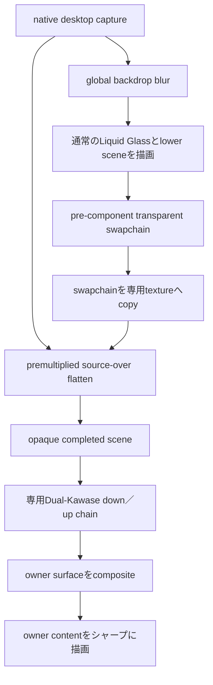

# 完成シーンを使うパーツ別Liquid Glassブラー

## このドキュメントの目的

通常のLiquid Glassは、OSから取得したデスクトップ画像だけを背景として使う。
一方、context menuのようにLaunchpad内の別パーツより手前へ出るsurfaceでは、
デスクトップだけでなく、すでに描画されたアプリアイコン、文字、folder panel
なども「そのパーツの背景」である。

このドキュメントでは、上層パーツを描画する直前の完成シーンを退避し、その
完成シーン全体をぼかしてLiquid Glassのbackdropとして使う仕組みを説明する。
context menuは最初の利用例であり、ここで定義する考え方はpopup、tooltip、
nested modalなど、別の上層パーツにも適用する。

Issue #160で判明した問題と修正理由も記録するが、主目的は今後の実装ガイドである。

## 用語

| 用語 | このドキュメントでの意味 |
|---|---|
| native backdrop | Windows.Graphics.Capture／ScreenCaptureKitなどで取得した、ウィンドウ背後のデスクトップ画像 |
| lower scene | 対象パーツより先に描画され、そのパーツの下に見えるLaunchpad内の全レイヤー |
| pre-component scene | lower sceneの描画を終え、対象パーツをまだ描いていない時点の透明swapchain |
| completed scene | pre-component sceneをnative backdropへ合成した、不透明な完成画像 |
| owner surface | completed sceneを背景として使う上層のGlass surface |
| owner content | owner surfaceの上へシャープに描くアイコン、文字、操作項目 |
| checkpoint | lower sceneとowner surfaceの間に置く、copy／flatten／blurの実行位置 |
| blur workspace | Dual-Kawaseの途中結果であるL1／L2／L3 texture |
| completed blur | downsampleとupsampleを最後まで終えた原寸のblur texture |

## いつこの方式を使うか

`GlassSurface.blur_radius`を変えるだけで十分か、completed sceneが必要かは、
surface直下に何が見えるべきかで判断する。

| 欲しい見え方 | 推奨方式 |
|---|---|
| デスクトップだけを屈折・ぼかす通常Glass | 既存のglobal backdrop blur |
| ページ内の下層だけをぼかし、OSデスクトップの置換を必要としないfocus表現 | `FocusBlurRenderer` |
| デスクトップとLaunchpad内の下層パーツを一緒にぼかす上層Glass | このcompleted-scene blur方式 |
| 下層をぼかさず、半透明の色だけを重ねる | 通常のalpha compositing |

次の質問が両方とも「はい」なら、この方式が必要になる。

1. 対象surfaceの下に、すでに描画済みのアイコン、文字、panelなどが存在するか。
2. それらを消さずに、デスクトップと一緒にぼかして見せたいか。

### Glass Focus Veilとの違い

[`Glass Focus Veil`](GLASS_FOCUS_VEIL.md)も「完成済みの下層シーンをぼかす」という
考え方は共通している。ただしFocus Veilは、lower sceneを最初から専用offscreen
textureへ描き、ページガラス形状の内側へ再合成する。開いたfolder panelはその後に
描くため、blurへ含まれない。

このドキュメントの方式は、任意のz-order checkpointで実際のpre-component
swapchainをcopyする。さらに透明ウィンドウのnative desktopまで含めた不透明画像へ
flattenし、owner surfaceのalphaでDWM backdropを置換する。したがって、context
menuのように「その時点まで画面に見えているものをすべて」背景にしたい場合に使う。

両者を将来共通化する場合も、mask、Y座標変換、desktop flatten、backdrop
replacementの有無を失わないこと。単に同じblur shaderを使っていることだけを理由に、
同じcomposite passへ統合しない。

## 見た目の契約

completed-scene blurを使うパーツは、次の関係を守る。

```text
手前    owner content                    シャープ
        owner surface                    completed blurをサンプル
        -------------------------------- checkpoint
        ownerより前に描画したmodal content  blurに含まれる
        top-level icon／label             blurに含まれる
        page／control／lower Glass         blurに含まれる
奥      native desktop                   blurに含まれる
```

context menuの場合、owner contentはメニュー項目のアイコンとラベルである。
open folder上にメニューを出した場合は、folder panelとchildもlower sceneへ含める。
そのため、メニュー直下のアイコンやfolder childは消えず、輪郭と色が拡散した状態で
残る。メニュー自身の項目はcheckpoint後に描くため、ぼけない。

## 全体アーキテクチャ



重要なのは、`pre-component scene`だけをblurしないことである。透明swapchainには、
DWMが最終的に背後へ置く実デスクトップのRGBが含まれていない。透明部分をそのまま
blurすると黒や透明色が混ざり、Launchpad内の半透明レイヤーも正しく見えない。
そこでnative backdropへflattenし、alpha 1のcompleted sceneを作ってからblurする。

flattenの式はpremultiplied-alphaのsource-overである。

```text
completed.rgb = launcher.rgb + desktop.rgb * (1 - launcher.a)
completed.a   = 1
```

`launcher.rgb`はすでにalphaが掛かったpremultiplied RGBとして扱う。ここでさらに
`launcher.rgb * launcher.a`を行うとalphaを二重に掛けることになる。

## 設計上の不変条件

別パーツへ展開するときも、次の条件は変えない。

1. checkpointは「blurへ含める最後のdraw」とowner surfaceの間に置く。
2. owner surfaceとowner contentはpre-component sceneへ含めない。
3. 透明sceneをnative backdropへflattenし、blur入力をalpha 1にする。
4. owner laneのsharp、reflection、blur sampleは同じcompleted scene系統から読む。
5. pyramid workspaceではなく、最後までupsampleしたcompleted blurをfinalで読む。
6. DWMのsharp desktopを戻したくないsurfaceはbackdrop replacementを使う。
7. resizeとcapture source変更時は、textureだけでなく全bind groupも再構築する。

このうち一つでも欠けると、「blurが弱い」ではなく、入力消失、sharp輪郭の再混入、
黒いfringe、古いframe、座標ずれのいずれかとして現れる。

## 1フレームの処理順

context menuでの実際の順序は次のとおり。

```text
1. global Glass、tile、icon、text、controlを描画
2. focus blur／veilを描画
3. folder／settings Glassとmodal contentを描画
4. profiler queryをresolveし、ここまでのencoderをsubmit
5. 現在のswapchainをpre-menu scene textureへcopy
6. pre-menu sceneをnative backdropへflatten
7. completed sceneをcontext専用Dual-Kawase chainでblur
8. 新しいencoderでcontext menu Glassを描画
9. context menuのicon／labelを描画
10. 最終submit／present
```

`src/renderer/frame.rs`のcheckpointは、modal contentの後、context menu Glassの前に
置かれている。ここを前へ動かすとfolder childがblurへ入らず、後ろへ動かすと
context menu自身が再帰的にblurへ混ざる。

## GPUリソースの役割

現在はcontext menu用として、`LiquidGlassRenderer`が次を所有する。

| リソース | サイズ／format | usage | 役割 |
|---|---|---|---|
| `context_menu_scene_texture` | viewport原寸／surface formatのnon-sRGB variant | `COPY_DST + TEXTURE_BINDING` | checkpoint時点の透明swapchainをraw pixelのまま保持 |
| `context_menu_source_texture` | capture原寸／`Rgba8Unorm` | `RENDER_ATTACHMENT + TEXTURE_BINDING` | desktopへflattenしたalpha 1のcompleted scene |
| `context_menu_blur_texture` | capture原寸／`Rgba8Unorm` | `RENDER_ATTACHMENT + TEXTURE_BINDING` | owner surfaceが読む完成済みblur |
| `blur_levels[0..3]` | 1/2、1/4、1/8 | `RENDER_ATTACHMENT + TEXTURE_BINDING` | global／contextが順番に共有する途中workspace |
| `context_menu_flatten_uniform_buffer` | 32 bytes | `UNIFORM + COPY_DST` | viewportとcapture regionの座標変換 |

swapchainのsRGB textureからscene textureへはcopyを行う。scene texture側では
`surface_format.remove_srgb_suffix()`を使い、copyされたencoded RGBをshaderで
そのまま読めるようにする。ここをsRGB samplingへ変える場合は、native backdrop、
blur texture、final targetを含む色空間全体を同時に見直す必要がある。

`context_menu_source_texture`と`context_menu_blur_texture`はcapture regionと同じ
解像度である。`SceneFlattenUniforms`の`backdrop_origin`と`backdrop_extent`を使い、
capture texture上のUVをviewport上のscene UVへ対応させる。

## Dual-Kawase blurの扱い

処理順は次のとおり。

```text
completed scene
  -> down L1 -> down L2 -> down L3
  -> up L2   -> up L1   -> full-resolution completed blur
```

L1／L2／L3はblur強度別の完成画像ではない。upsample中にL2とL1は上書きされる
workspaceであり、final shaderから直接表示してはいけない。surfaceごとに異なる
blur profileが必要な場合は、profileごとにchainを最後まで実行し、原寸の完成出力を
個別に保持する。

`GlassSurface.blur_radius`は現在、次の二つへ変換される。

- pyramid depth: 弱いblurは浅く、16px以上は3 levelを使う
- kernel sample scale: `radius / 16`を基準にsample幅を変える

既定値では通常面16pxが1.0、context menu 24pxが1.5、opening／closing seed側の
32pxが2.0になる。低解像度captureではtexture pixelとscreen pixelの比率も補正する。

## backdrop replacementが必要な理由

Windowsの透明ウィンドウでは、shaderがblurred RGBを出しても、出力alphaが1未満なら
DirectComposition／DWMが実デスクトップを再び混ぜる。

```text
window output = completed blur * 0.92 + real desktop * 0.08
```

この0.08でも細い文字やアイコン輪郭はsharpに見える。そのためowner surfaceでは、
`GlassSurface.backdrop_replacement`を使って通常の半透明Glassと下層置換materialを
区別する。

- `0`: 通常の半透明Liquid Glass
- `1`: shape coverageを出力alphaに使い、completed sceneで実デスクトップを置換
- `0..1`: 開閉animation中の補間

context menuでは`content_opacity`をbackdrop replacementへ接続している。完全に
開いた中央はalpha 1、SDFの角はcoverage、閉じる途中はrevealと一緒に透明へ戻る。

replacementを有効にするlaneでは、final shaderのblur sampleだけでなく、屈折や
reflectionに使うsharp sampleも同じcompleted sceneから読む。sharp sampleだけ
native desktopへ戻すと、rimやreflectionから下層アイコンが消えるためである。

## RenderModelからGPUまでのデータフロー

context menuでは、意味論とGPU処理を次の境界で分けている。

```text
ContextMenuState
  -> layout/context_menu.rs
       RenderModel::set_glass_batch(
         GlassLayer::ContextMenu,
         vec![GlassSurface {
           blur_radius: Some(...),
           backdrop_replacement: ...,
           ...
         }],
       )
  -> renderer/prepare.rs
       context laneのshape／radius／replacementを抽出
  -> LiquidGlassRenderer
       checkpoint source、flatten、blur、final composite
```

`GlassSurface`はパーツ名ではなく描画要求だけを持つ。rendererが`UiId`文字列から
「menu」「tooltip」などの機能を推測してGPU laneを選んではいけない。新しい
パーツを追加するときも、`GlassLayer`または将来のcompositing laneを明示する。

## 別パーツへ導入する手順

### 1. 何をblurへ含めるか決める

対象パーツを含む、ではなく、対象パーツの直前までに存在するレイヤーを列挙する。

例としてtooltipをcontext menuより手前へ出すなら、tooltipのlower sceneには
context menu Glassとその項目contentも含まれる。checkpointはcontext menu contentの
後、tooltip Glassの前になる。

```text
base scene
-> checkpoint A -> modal Glass -> modal content
-> checkpoint B -> context menu Glass -> context menu content
-> checkpoint C -> tooltip Glass -> tooltip content
```

各checkpointは、その左側にあるすべてをcompleted sceneへ含め、右側にあるownerを
含めない。新しいパーツのz-orderを決めれば、checkpointの位置も一意に決まる。

### 2. owner surfaceとowner contentを分ける

owner surfaceはcompleted blurを使って描き、owner contentはその後へ描く。
同じpassや同じbatchへ混ぜると、owner contentまでblur入力に入るか、逆にlower
contentがblurへ入らない。

### 3. compositing laneを定義する

既存checkpointと同じ下層を使えるsurfaceは、同じlaneへbatch化できる。異なる
checkpointが必要なら別laneが必要である。

| ケース | lane／resource方針 |
|---|---|
| 同じcheckpoint、同じblur profile | completed sceneと完成blurを共有可能 |
| 同じcheckpoint、異なるblur profile | scene sourceは共有し、profileごとの完成blurを保持 |
| 異なるcheckpoint | pre-component copy、completed scene、完成blurを別laneとして管理 |
| surface同士をsmooth-unionしたい | 同じgeometry laneへ入れる |
| 重なっても別Glassとして見せたい | geometry laneを分離する |

### 4. RenderModelへ要求値を出す

layout側で最低限、次を決める。

```rust,ignore
GlassSurface {
    blur_radius: Some(24.0),
    backdrop_replacement: open_progress,
    // rect、radius、material、behavior、layerなどは省略
}
```

`blur_radius`だけを設定してもcompleted scene方式にはならない。どのcheckpointと
sourceを使うかはcompositing laneの責務である。

### 5. checkpointをframe orchestrationへ置く

実装順序は必ず次になる。

```text
draw lower scene
-> finish／submit lower encoder
-> copy pre-component scene
-> flatten over native backdrop
-> run full blur chain
-> create／continue owner encoder
-> draw owner Glass
-> draw owner content
```

現在の実装は`has_context_menu_glass()`で必要性を判定し、
`prepare_context_menu_scene_blur()`でcopyからblurまでを実行する。新しいlaneでも、
非表示時にcheckpointと追加GPU passを走らせない判定を持たせる。

### 6. final bind groupをcompleted sceneへ接続する

owner laneのfinal bind groupでは次を対応させる。

```text
sharp backdrop binding -> completed scene source
blur backdrop binding  -> completed blur output
geometry／tint binding -> owner laneのgeometry
uniforms               -> owner laneのradius／replacement／mapping
```

### 7. resource lifecycleをすべて処理する

次の場合にscene source、blur output、pyramid bind group、flatten bind groupを再構築する。

- window resize／DPI変更
- capture regionのtexture size変更
- CPU captureからGPU shared textureへの切替
- GPU shared textureからCPU fallbackへの切替
- macOSのephemeral IOSurface copy target変更
- surface format変更

一つでも古いviewをbind groupへ残すと、位置ずれ、stretch、古いframe、wgpu validation
errorの原因になる。

## 2つ目の利用箇所を実装するときのリファクタ方針

現時点のresource名とpublic methodはcontext menu専用である。2つ目のパーツへ同じ
仕組みを入れるときは、同じfield群をコピーして`tooltip_*`などを増やすのではなく、
completed-scene laneとしてまとめる。

概念上の所有単位は次のようになる。

```rust,ignore
struct CompletedSceneBlurLane {
    scene_texture: wgpu::Texture,
    scene_view: wgpu::TextureView,
    source_texture: wgpu::Texture,
    source_view: wgpu::TextureView,
    blur_texture: wgpu::Texture,
    blur_view: wgpu::TextureView,
    flatten_uniform_buffer: wgpu::Buffer,
    flatten_bind_group: wgpu::BindGroup,
    blur_down_bind_groups: [wgpu::BindGroup; 3],
    blur_up_bind_groups: [wgpu::BindGroup; 3],
}
```

このlaneへfeature名を持たせる必要はない。必要なのはcheckpoint順、surface geometry、
blur profile、backdrop replacement、resource mappingである。複数laneが同じframeで
有効な場合は、奥から手前へcheckpointを実行する。手前のlaneは、それ以前に描いた
owner surfaceとowner contentを含む新しいcompleted sceneを作る。

blur pyramid workspaceは、chainを直列submitする限り複数laneで共有できる。ただし
各laneのfull-resolution完成blurは共有しない。後続chainがworkspaceを上書きしても、
先行laneのfinal passが読む完成出力は保持される必要がある。

## wgpu上の制約

### render targetを同時に読まない

現在書き込んでいるswapchainを同じrender passでtexture samplingしてはいけない。
lower sceneのpassを終え、copy用usageへ遷移して専用textureへ退避する。

### 使用スコープを分ける

Dual-Kawaseでは、あるpassの出力を次のpassで入力として使う。wgpu／D3D12の
usage scopeを明確に分けるため、各段を別command encoderとしてencodeし、順序を
保ったcommand buffer列としてsubmitする。

### copy前のsubmitを省略しない

checkpointより前のdraw commandがまだsubmitされていない状態で、別submitのcopyを
先に実行すると未完成frameを読む。現在はlower encoderをfinish／submitした後に
`prepare_context_menu_scene_blur()`を呼ぶ。

### swapchain usageを維持する

surfaceとheadless QA targetには`COPY_SRC`が必要である。`SurfaceConfiguration`や
offscreen textureを変更するときにこのusageを落とさない。

## 更新頻度とGPUコスト

global backdrop blurはdesktop captureやparameterが変わるまで再利用できる。
completed-scene blurはlower sceneにアイコンanimation、scroll、modal animationが
含まれるため、owner surfaceの表示中は原則として毎frame更新する。

context laneで追加される主なコストは次のとおり。

- viewport原寸のGPU texture copy 1回
- capture原寸のflatten pass 1回
- blur profileに応じたdown／up pass
- scene copy、flattened source、completed blurの常駐texture各1枚
- lower sceneのsubmitとowner sceneのsubmitを分けるCPU／queue overhead

最適化は正しい見た目を維持したうえで行う。

- owner非表示時は全追加処理をskipする
- 同じcheckpointとprofileを持つsurfaceはsourceと完成blurを共有する
- capture regionをshapeのunionと最大sample supportへ絞る
- lower sceneが静止していることを確実に判定できるlaneだけdirty trackingする
- full viewport copyを部分copyへ変える場合はfilter境界のpaddingを保証する

## よくある失敗

### desktop captureだけをblurする

menu下のLaunchpad iconやfolder contentがcompleted outputへ入らず、消えたように見える。

### blurred desktopを半透明で上から足す

DWMまたは既存targetのsharp輪郭が再混入し、「ぼけた画像を加算しただけ」に見える。

### transparent sceneだけをblurする

透明部分へ黒が混ざり、実デスクトップとの合成結果も一致しない。

### pyramid levelを完成blurとして表示する

L1／L2／L3は途中workspaceなので、強度が意図どおりにならず、後続passの上書きにも
依存する。

### blur bindingだけをcompleted sceneへ変える

sharp／reflection sampleがnative desktopのままだと、Glass内部やrimで下層iconが
部分的に消える。

### checkpointをowner contentの後へ置く

文字や操作アイコン自身がblur入力へ入り、ghostや自己ぼかしになる。

### lower sceneのsubmit前にcopyする

前frameまたは途中までしか描かれていないframeを取り込む。

### context専用fieldを機能ごとに複製する

resize／capture fallback時のresource再構築漏れが増える。2つ目からgeneric laneへ
まとめる。

## 実装ファイルの対応

| 責務 | 現在の実装 |
|---|---|
| per-surface radius／replacementとbatchのcompositing layer | `src/ui_model/render_model.rs` |
| context menuの要求値生成 | `src/layout/context_menu.rs` |
| RenderModelからcontext laneを抽出 | `src/renderer/prepare.rs` |
| checkpointと全体の描画順 | `src/renderer/frame.rs` |
| completed-scene resourceとpipeline所有 | `src/liquid_glass/renderer.rs` |
| copy／flatten／blur orchestration | `src/liquid_glass/renderer/frame.rs` |
| texture／buffer／bind group生成 | `src/liquid_glass/renderer/resources.rs` |
| premultiplied scene flatten | `assets/shaders/liquid_glass_scene_flatten.wgsl` |
| Dual-Kawase down／up | `assets/shaders/liquid_glass_blur_downsample.wgsl`、`liquid_glass_blur_upsample.wgsl` |
| completed sceneを使うGlass final | `assets/shaders/liquid_glass_final.wgsl` |
| WGSL／pipeline layout validation | `tests/wgsl_validation.rs` |

## 自動テスト

新しいcompleted-scene laneを追加するときは、少なくとも次を固定する。

- Rust／WGSL uniform sizeとalignment
- flatten shaderのWGSL validation
- flatten bind group layoutとpipelineのwgpu validation
- owner laneのradius／replacementがRenderModelからrendererへ届くこと
- blur radiusからpyramid depth／sample scaleへの変換
- blur shaderの定数色energyが維持されること
- owner非表示時にcheckpointが実行されないこと
- resize／capture texture size変更後にresourceとbind groupが更新されること

## 視覚QA

細かい文字、色の異なるアプリアイコン、folder childがowner surface直下へ入る配置で
確認する。

1. native desktopの輪郭がowner surface内で明確にぼける
2. Launchpad内のlower icon／label／panelが消えずにぼけて残る
3. owner contentはシャープなまま残る
4. owner surface外は意図せず変化しない
5. 開閉中にblur強度とreplacement alphaが連続して変わる
6. 角にblack／transparent fringeが出ない
7. owner surfaceのrim／reflectionでもlower sceneが途切れない
8. open folderなど別modal上へ重ねても正しいz-orderになる
9. DPI変更／resize後も座標が一致する
10. GPU capture、CPU fallback、macOS ephemeral captureで同じ結果になる
11. `disable_blur`時はsharpなcompleted sceneへ戻り、lower iconが消えない
12. 開閉を繰り返して前frameの残像が出ない

通常起動ではself-captureを防ぐためwindow capture exclusionを維持する。
スクリーンショットと決定的sequence QAの手順は
[`EDIT_MODE_VISUAL_QA.md`](EDIT_MODE_VISUAL_QA.md)と
[`GPU_SEQUENCE_QA.md`](GPU_SEQUENCE_QA.md)を参照する。

## context menu実装時の調査結果

Issue #160の初期実装では、通常面と異なるblur radiusを指定しても、次の理由で
期待する見え方にならなかった。

1. pyramidの途中levelを完成blurとして扱っていた
2. menuのalphaが最大0.92で、DWMからsharp desktopが戻っていた
3. 専用blurの入力がdesktop captureだけで、Launchpad内のlower sceneが消えていた

最終的に、lane別のfull-resolution完成blur、backdrop replacement、pre-menu sceneの
copy／flattenをすべて組み合わせて解決した。三つは別々の問題であり、どれか一つ
だけでは「デスクトップもLaunchpad内の下層も、消えずにきちんとぼける」という
見た目にはならない。
