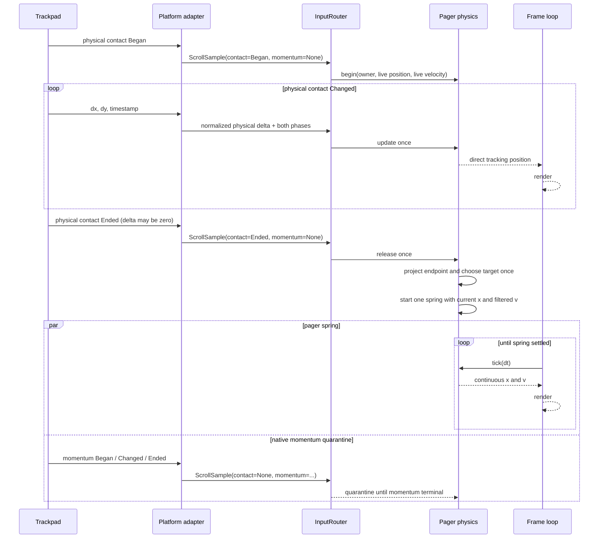

# トラックパッドページング仕様

Status: PR #134 implementation target.

## 背景と目的

メイングリッドとフォルダ内グリッドの横ページ移動を、macOS Launchpad
で学習した操作感に近づけます。対象は精密スクロール入力を出すトラックパッドで、
次を同時に満たすことを目的とします。

- 指が動いている間は、途中で方向を反転してもreleaseまで連続して追従する。
- 先頭・末尾では、入力を無視せず、単調に抵抗が増すrubber-bandで端を伝える。
- 指を離した位置と速度を、ただ1本のspringへ連続して引き継ぐ。
- 一度止まってから同じ方向へ再加速する二段階モーションを作らない。
- 開いているフォルダも、メイングリッドと同じ入力routerと物理モデルを使う。
- DPI、リフレッシュレート、イベント間隔が変わっても、ページ幅で正規化した挙動を
  保つ。

この仕様の「macOS Launchpadに近い」は、非公開実装の複製ではありません。
Apple公式資料で確認できる原則を制約にし、Launchpad固有の値は実機比較で調整します。

## 非目標

- Appleの非公開API、バイナリ解析、私有定数を使った完全な複製。
- マウスホイールによるメイン／フォルダページ移動の追加。
- 設定パネルの縦連続スクロール、編集モードの並べ替え、フォルダのデータモデル、
  Liquid Glass描画の再設計。
- 1回のフリックで2ページ以上移動する高速ページ送り。
- GPU連番キャプチャを、絶対的なフレーム性能測定の代用にすること。

## 根拠と数値の扱い

### Apple公式から採用する設計原則

macOS 15のLaunchpadユーザーガイドは、ページ間を二本指スワイプで移動できることを
明記しています[^launchpad]。一般のMac向け資料も、二本指の左右スワイプを
前後ページ移動として説明しています[^multitouch]。HIGは、ジェスチャが対象へ直接作用し、
即時のフィードバックを返すことを重視しています[^gestures][^pointing-devices]。

Appleの「Designing Fluid Interfaces」は、次を一般設計原則として示します。

- swipeの判別距離はiOSでは通常10 pointsである。
- swipe成立時に移動軸を決める。
- 操作中は入力と表示を1対1で追従させる。
- 最終イベントだけでなく、入力履歴から速度を求める。
- rubber-bandingは、端に到達したことを追従しながら穏やかに知らせる。
- 位置だけでなく速度も使い、操作の運動量を次の動きへ渡す。

ここでの`10 points`は、Apple公式の**一般的なiOSジェスチャ例**であり、
macOS Launchpadの閾値ではありません[^fluid-interfaces]。

「Animate with springs」は、ジェスチャからアニメーションへ移るときに位置と速度を
連続させ、springへ初速度を渡せることを重視しています。また、springは必ずしも
bouncyである必要がなく、bounceなしのspringも広く使われると説明しています
[^springs]。AppKitは物理的な指操作の`phase`と、指を離した後の
`momentumPhase`を別々に公開しています[^trackpad-events][^momentum-phase]。
この区別は本仕様の入力モデルでも失わないものとします。

AppKitの`trackSwipeEvent`は、端部のdampeningと完了値`-1 / 0 / 1`を扱える
流体的なswipe追跡APIです[^track-swipe]。`SwipeTrackingOptions.lockDirection`は
選択可能な**opt-in option**であり、AppKitがあらゆるscrollへ自動適用する既定挙動
ではありません[^swipe-options]。本製品では、接触中の小さな往復でleft/rightを
誤固定しないため、`lockDirection`相当の符号固定を**採用しません**。
Apple資料から確認できるのはhorizontal／verticalの軸判別、直接追従、速度連続という
一般原則までです。同一contact中に変位0を横切って反対側pageまで追従できることは
Launchpadの公開契約として確認できず、本仕様で明示する製品判断です。

物理入力`0.50`に対する端部表示量をおよそ`0.125`にする値は、API契約値でも
Appleが公開したLaunchpad値でもなく、比較を始めるための**ヒューリスティック校正値**
です。HIGとWWDC資料の射程は、直接追従、連続フィードバック、速度連続、soft boundary
という一般原則までです。OS momentumをページャから隔離し、独自springを1本だけ使う
ことも、これらの原則を満たすための本製品の設計判断であってAppleの実装要件では
ありません。

### Appleが公開していないもの

次はApple公式資料から確認できません。

- Launchpadのrubber-band関数、最大表示量、係数。
- ページ確定の距離・速度閾値。
- 速度推定window、springの角周波数、減衰比、settle時間。
- 60 Hz、120 Hz、各DPIでの内部許容誤差。
- フォルダとメイン画面が内部で同じscroll実装を使うかどうか。

したがって、本書の値には必ず次のいずれかを付けます。

| 区分 | 意味 |
| --- | --- |
| Apple公式 | Appleが資料内で明示した値またはAPI契約 |
| 一般設計指針 | Apple公式の一般例から、このUIへ適用する制約 |
| 第三者 | 公開された観察、再現実装、逆解析。Apple保証ではない |
| チューニング初期値 | PR #134で比較を始める値。実機QAで変更可能 |

本仕様で特に混同しやすい判断の出所は次の通りです。

| 項目 | 出所 |
| --- | --- |
| horizontal／verticalの軸判別、直接追従、履歴速度、位置・速度のspring連続 | Apple公式の一般設計指針 |
| AppKitのcontact phaseとmomentum phaseが別であること | Apple公式API契約 |
| Launchpad固有のleft/right intent確定時点、0 crossing、deep reverse挙動 | 公開資料では不明 |
| contact中にleft/rightをlockしない、0 crossingを通常sampleとして扱う | 本製品の判断 |
| Undecided中のrender-only preview、Vertical lock時のfreezeとterminal return | 本製品の判断 |
| Ended時だけ3候補からtargetを1回選び、独自springを1本使う | 本製品の判断 |
| rubber式と係数、速度window、投影horizon、spring定数 | チューニング初期値 |

第三者資料で知られている`UIScrollView`近似
`B(x) = x d c / (d + c x)`と`c = 0.55`は比較対象にできますが、
Apple公式値として扱いません[^holko]。本仕様の主rubber-band値は、
Launchpadの端をより硬く見せる別の初期値を使います。

## 現状分析

調査基準commitは`bd73c05`です。この仕様作成時点の`HEAD`も`bd73c05`ですが、
未コミットWIPが存在するため、以下では`git show bd73c05:<path>`の行番号を
「基準」、現在のファイルを「WIP」と呼び分けます。

| 課題 | 原因 |
| --- | --- |
| 先頭・末尾の引張りが逆向きに見える | `src/scroll.rs:596-601`が表示量を`over * factor`で作り、`src/scroll.rs:607-614`が`factor = 1/(1+(over/k)^2)`を返します。したがって表示量は`over/(1+(over/k)^2)`となり、`over > k`で負勾配です。作業ツリーでも同じ構造が`src/scroll.rs:722-740`に残っています。 |
| フリック中に一瞬逆方向へ動く／カクつく | `src/scroll.rs:493-507`が単発イベントの`delta / dt`をrelease速度にし、終端付近のノイズと符号反転を増幅します。さらに`src/scroll.rs:519-526`は新sessionのanchorを、settle途中のlive位置ではなく`nearest snap`へ丸めます。新しいcontactまたはmomentumをsession開始と誤認すると、位置・速度の所有者が切り替わり、ジャンプや逆方向の初速度になります。 |
| フォルダ内をトラックパッドで移動できない | `Scroller`自体は`src/app/state.rs:268-275`でフォルダにも保持され、pointer dragは`src/app/update.rs:1204-1242`から同じ`Scroller`へ入ります。しかしwheel routerの`src/app/action.rs:541-559`、特に`!self.folders.is_active()`の条件により、フォルダ表示中の精密wheel入力は破棄されます。つまり物理モデルの未共通化ではなく、入力routingの未共通化です。 |
| 払った後に止まり、再度加速する | `src/app/handler.rs:288-296`は`dx = dy = 0`のイベントをphaseに関係なく捨てるため、ゼロdeltaの`Ended`を失います。その後`src/scroll.rs:633-643`の120 ms timeoutまで`WheelGesture`で停止し、timeout後にspringが始まります。同時にAppKitの`phase`と`momentumPhase`を1個の`TouchPhase`へ畳むと、指release、OS momentum開始、新contactの区別ができず、`src/scroll.rs:470-480`のsession／`ignoreMomentum`制御が二重駆動になります。 |

GPU QAにも欠落があります。`src/qa.rs:82-94`の`QaAction`には精密wheel入力と
contact／momentum phaseがないため、productionの問題経路を決定的に再生できません。

### 基準とWIPの差分

| 論点 | `bd73c05` | WIP状態 |
| --- | --- | --- |
| ゼロdelta terminal | `src/app/handler.rs:293-296`で破棄 | `src/app/handler.rs:299-310`で`Ended/Cancelled`を通す修正済み |
| release速度 | `src/scroll.rs:493-507`の単発差分 | 約80 msのsample ringへ修正済み |
| 無動作timeout | `src/scroll.rs:633-643`で120 ms後にspring開始 | timeoutは除去済み |
| axis lock | なし | 追加済み。ただし判別中のrender-only previewと符号を固定しない軸判別へ修正が必要 |
| rubber-band | `src/scroll.rs:596-614`で負勾配 | WIP `src/scroll.rs:722-740`にも残存 |
| 新session anchor | `src/scroll.rs:519-526`でnearest pageへ丸める | WIP `src/scroll.rs:621-633`にも残存 |
| main／folder wheel routing | folder active時に破棄 | WIP `src/app/action.rs:541-560`にも残存 |
| contact／momentum分離 | 1個の`TouchPhase` | 残存 |
| physical／logical単位 | `PixelDelta`をlogicalへ戻しphysical boundへ加算 | WIPにも残存 |
| GPU scenario wheel | `QaAction`に存在しない | 残存 |

依存するwinitは`Cargo.lock:3964-3967`の`0.30.13`です。同版のmacOS実装は、
`scrollingDeltaX/Y`をscale factorでphysical `PixelDelta`へ変換した後、
`momentumPhase`を優先して`phase`と同じ`TouchPhase`へ畳みます
（upstream `view.rs:668-700`）[^winit-macos]。したがって、現在の
`WindowEvent::MouseWheel`だけから元の2つのphaseを復元することはできません。
phase分離にはnative adapterまたはwinit側の拡張が必要です。

## 入力所有権

1つの入力streamを複数surfaceや複数physics phaseへ同時に渡してはいけません。
`InputRouter`は`gesture_id`ごとにただ1つのownerを決め、終端まで固定します。
surfaceのowner、ページの運動、native scroll sequenceは別の関心事です。
`PagerMotion`と`NativeSequence`を1個のenumへ押し込まず、直交する状態として持ちます。

```mermaid
stateDiagram-v2
    [*] --> Idle
    Idle: owner = None

    Idle --> Classifying: precise contact Began
    Classifying --> SettingsTracking: settings panel is active
    Classifying --> Blocked: folder Opening or Closing
    Classifying --> Blocked: child drag, top-level drag, or page_press
    Classifying --> FolderTracking: durable folder phase is Open
    Classifying --> GridTracking: main grid is available
    Classifying --> Ignored: unsupported source

    SettingsTracking --> SettingsAwaitingMomentum: contact Ended / retain owner
    SettingsAwaitingMomentum --> SettingsMomentum: momentum Began
    SettingsAwaitingMomentum --> Idle: platform sequence-complete
    SettingsAwaitingMomentum --> Classifying: new physical Began / new gesture id
    SettingsMomentum --> Idle: momentum Ended or Cancelled
    SettingsTracking --> Idle: contact Cancelled
    FolderTracking --> FolderVerticalFrozen: axis becomes Vertical
    GridTracking --> GridVerticalFrozen: axis becomes Vertical
    FolderVerticalFrozen --> FolderSettling: contact Ended / target q0 once
    GridVerticalFrozen --> GridSettling: contact Ended / target q0 once
    FolderVerticalFrozen --> FolderSettling: contact Cancelled / v0=0; target q0
    GridVerticalFrozen --> GridSettling: contact Cancelled / v0=0; target q0
    FolderTracking --> FolderSettling: contact Ended / choose target once
    GridTracking --> GridSettling: contact Ended / choose target once
    FolderTracking --> FolderSettling: contact Cancelled / v0=0; target=clamp(gesture_start_page)
    GridTracking --> GridSettling: contact Cancelled / v0=0; target=clamp(gesture_start_page)
    Ignored --> Idle: contact Ended or Cancelled
    Blocked --> Idle: native sequence terminal

    FolderSettling --> Idle: spring settled
    GridSettling --> Idle: spring settled
    FolderSettling --> Classifying: new physical contact / preserve live x and v; old quarantine unchanged
    GridSettling --> Classifying: new physical contact / preserve live x and v; old quarantine unchanged
```



ownerの優先順位と契約は次の通りです。

1. 設定パネルがactiveなら`SettingsContinuousScroll`。contact `Ended`後は
   `SettingsAwaitingMomentum`で同じownerを保持し、momentum `Began`後は
   `SettingsMomentum`として同じownerが消費する。どちらも別ownerへfall-throughしない。
2. フォルダのdurableな`FolderPhase::Open`だけが`FolderPager(folder_id)`を取得できる。
   `Opening`／`Closing`は`BlockedUntilTerminal`が所有し、mainへ渡さない。
3. `FolderChildDrag`、`TopLevelDrag`、または`page_press`がactiveならwheelは
   `BlockedUntilTerminal`へ送る。child drag中に許すページ移動は、既存の左右
   edge dwellが発行するprogrammatic `settle_to_page`だけである。
4. 上記モーダル条件がなく、mainが操作可能な場合だけ`MainPager`。
5. axisがverticalへlockしても、選択済みの`MainPager`または`FolderPager`がterminalまで
   ownerを保持する。lock時のrender-only preview位置をfreezeし、terminalで`q0`へ戻す。
   途中の横ノイズでownerを再選択しない。
6. mouseの`LineDelta`は従来どおり設定パネルだけへ渡し、ページャでは無視する。
7. owner確定後にモーダルの表示状態が変わっても、同じ`gesture_id`を別surfaceへ
   移さない。必要なら`Cancelled`を発行してから新gestureを始める。

`AxisIntent`は`Undecided / Horizontal / Vertical`だけを持ち、left/rightの
intentとは完全に分離します。contact中にstickyになるのはH/V軸だけです。
left/rightのstate、符号lock、方向別anchorは持ちません。軸判定は
`H = Σ|canonical_dx|`、`V = Σ|canonical_dy|`のような符号に依存しない移動量を使い、
最初の小さな右移動より、contact全体で蓄積した軸の証拠を優先します。

`Undecided`中は全sampleのsigned displacementと速度履歴をbufferしながら、
横成分をrender-only previewへ即時反映します。local domain内は1:1、domain外は
同じ入力を後述のrubber-bandへ通します。previewはpersistent page、
`gesture_start_page`、anchor、targetを変更しません。Horizontal確定時は同じ表示位置と
履歴をそのままtrackingへ昇格し、bufferのreplay、catch-up jump、位置／速度resetを
行いません。

Vertical確定時は、その時点の小さなrender-only preview位置をcontact terminalまで
freezeします。途中で`q0`へ瞬間rollbackせず、terminalで`q0`をtargetとするreturnへ
移ります。完全な初動追従と、縦gestureで横previewを一切見せないことは両立しないため、
これは連続性を優先した本製品の判断です。AppleのLaunchpad公開仕様ではありません。

| パラメータ | 初期値 | 区分 |
| --- | ---: | --- |
| 方向判別の移動量 | 10 logical px | 一般設計指針。Apple公式の一般的なiOS例は10 points |
| dominant axis比 | 1.2 | チューニング初期値 |
| 履歴window | 80 ms | チューニング初期値 |
| 1回の最大移動 | 1 page | 本プロジェクトの製品仕様 |

`10 logical px`はgesture開始時のscale factorを`S0`として
`lock_distance_physical = 10 * S0`へ1回だけ変換します。gesture途中でDPIが変わっても
閾値の単位を切り替えず、既に蓄積したphysical deltaと同じ単位で比較します。

### contact中の規範位置と往復入力

platform境界で符号を正規化した横deltaを`canonical_dx`とします。開始時のlive位置を
`x_anchor`、開始pageをpersistentな`q0`とし、contact中の規範値は次だけで更新します。

```text
D(t) = Σ canonical_dx
x_raw(t) = x_anchor + D(t)
x_display(t) = bounds_map(x_raw(t), local_domain)
```

`bounds_map`はlocal domain内で恒等写像、存在しないpage側および1 contact最大1 pageの
外側でだけ後述の狭義単調rubber-bandを適用します。したがってinteriorでは1:1で、
端部でも非ゼロ入力に対して表示が完全停止しません。`D`、sample history、
filtered visible velocityはsampleごとにsigned値として更新し、反転を自然に表現します。
filtered velocityはrender後の`x_display`履歴から求めます。

`D = 0`は状態遷移でもpage境界でもありません。contact terminalより前に0を横切っても、
次をすべて禁止します。

- clamp、静止、re-anchor、buffer replay。
- velocity historyのreset、page commit、target決定。
- spring生成、`Tracking`からのphase change、axis再判定。

有効なphysical contactが継続し、ownerがpagerで、`AxisIntent`が
`Undecided`または`Horizontal`なら`Tracking`を維持します。例外は
`Vertical`確定、明示的`Cancelled`、owner surfaceのdomain mutation、または新しい
排他的モーダル操作による明示的cancelだけです。contact中の小さな停止や符号反転、
0 crossing、page center通過、速度閾値到達をterminalとして扱いません。

2ページ目で指定された往復traceは、`+`を「表示グリッドが右へ移動」として次の
時系列になります。`P`はpage幅です。速度列は後述する規範推定器の結果で、
このtraceは3ページ以上、`q0 = 1`、local domain内を前提にします。

| timestamp | event | `canonical_dx/P` | `D/P` | 表示位置 | expected `v/P/s` | phase | target / spring |
| ---: | --- | ---: | ---: | --- | ---: | --- | ---: |
| `0 ms` | Began | `0` | `0` | `x_anchor` | `0.000000` | Tracking, Undecided | `0 / 0` |
| `16 ms` | 少し右 | `+0.020` | `+0.020` | `x_anchor+0.020P` | `+1.250000` | Tracking | `0 / 0` |
| `32 ms` | 少し左 | `-0.015` | `+0.005` | `x_anchor+0.005P` | `+0.025000` | Tracking | `0 / 0` |
| `48 ms` | 少し右 | `+0.010` | `+0.015` | `x_anchor+0.015P` | `+0.157895` | Tracking | `0 / 0` |
| `64 ms` | 大きく左 | `-0.450` | `-0.435` | `x_anchor-0.435P` | `-6.477941` | Tracking、0を連続通過 | `0 / 0` |
| `80 ms` | Ended | `0` | `-0.435` | release位置を維持 | `-5.182353` | Settling | `1 / 1` |

`x_anchor = x(q0) = -1P`、`τ = 0.35 s`を代入すると、Endedで
`x_projected/P = -3.248823529412`
（anchor相対`-2.248823529412P`）です。候補page
`C = {0, 1, 2}`の表示位置は`{0P, -1P, -2P}`なので、距離はそれぞれ
`3.248824P, 2.248824P, 1.248824P`となり、targetは一意に`2`です。初期の小さな
右移動ではなく、後半の決定的な左移動がfiltered velocityとprojected endpointへ
反映されることを、この固定値で保証します。

途中で十分大きく片側へ進んだ後のdeep reverseも同じ規則です。

| event | `canonical_dx/P` | `D/P` | 規則 |
| --- | ---: | ---: | --- |
| Began | `0` | `0` | `q0`をpersistent anchorとして保存 |
| 片側へ深く移動 | `+0.700` | `+0.700` | previewだけ。page commitしない |
| 反転して0を通過 | `-0.850` | `-0.150` | clamp／re-anchor／springなし |
| さらに反対側へ | `-0.300` | `-0.450` | 同じTrackingと履歴を継続 |
| Ended | `0` | `-0.450` | この時点だけtargetとspringを各1回生成 |

page indicatorは`x_display/P`から連続的なpreviewを描いてよい一方、persistentな
current pageと`q0`はsettle完了まで変更しません。gesture anchorはEndedで履歴計算用に
freezeしてよいものの、target pageをpersistent current pageとして先行commitしません。

### 直交するnative sequenceとpager motion

```mermaid
stateDiagram-v2
    state Orthogonal {
        state NativeSequence {
            state ActiveContactSlot {
                [*] --> NoActiveContact
                NoActiveContact --> ActiveContact: physical Began / set active_contact
                ActiveContact --> NoActiveContact: Ended or Cancelled / clear active_contact
                ActiveContact --> ActiveContact: Changed / same gesture id
            }
            --
            state PagerQuarantineRegistry {
                [*] --> QuarantineEmpty
                QuarantineEmpty --> QuarantineNonEmpty: pager Ended / insert old gesture id
                QuarantineNonEmpty --> QuarantineNonEmpty: new physical Began / set unchanged
                QuarantineNonEmpty --> QuarantineNonEmpty: old momentum Changed / consume only
                QuarantineNonEmpty --> QuarantineNonEmpty: old momentum terminal / remove one id; others remain
                QuarantineNonEmpty --> QuarantineEmpty: remove final id
            }
            --
            state SettingsContinuation {
                [*] --> SettingsNone
                SettingsNone --> SettingsAwaitingMomentum: settings contact Ended
                SettingsAwaitingMomentum --> SettingsMomentum: momentum Began
                SettingsAwaitingMomentum --> SettingsNone: platform sequence-complete
                SettingsAwaitingMomentum --> SettingsAwaitingMomentum: new physical Began / continuation unchanged
                SettingsMomentum --> SettingsNone: momentum Ended or Cancelled
            }
        }
        --
        state PagerMotion {
            [*] --> MotionIdle
            MotionIdle --> Tracking: pager owner acquired
            Tracking --> VerticalFrozen: axis becomes Vertical
            Tracking --> Settling: Ended / choose target once
            Tracking --> Settling: Cancelled / v0=0; target=clamp(gesture_start_page)
            VerticalFrozen --> Settling: Ended / target q0 once
            VerticalFrozen --> Settling: Cancelled / v0=0; target q0
            Settling --> MotionIdle: spring settled
            Settling --> Tracking: new physical contact
        }
    }
```



`NativeSequence`を単一enumにせず、少なくとも次の直交fieldで管理します。

```text
NativeSequenceState {
    active_contact: Option<Contact { gesture_id, owner, ... }>,
    quarantined_gesture_ids: Map<GestureId, PagerQuarantine>,
    settings_continuation: None | AwaitingMomentum | Momentum,
}
```

ページャではcontact `Ended`と同timestampで`PagerMotion::Settling`を開始し、
`active_contact`をclearして、そのIDを`quarantined_gesture_ids`へ追加します。
clear、map insert、spring開始は1つのevent transactionとして観測され、途中状態を
routerやframe loopへ公開しません。
springが先に`PagerMotion::Idle`へ到達しても、対応するmomentum
`Ended/Cancelled`を受けるまでmap entryを保持します。

旧IDがquarantine中でも、新しいphysical `Began`は別IDで`active_contact`を取得できます。
このとき旧entryを削除、置換、または新IDへ付け替えません。旧IDのmomentum
`Changed/Ended`は該当map entryだけが消費し、新contactの位置、速度履歴、phase、owner、
target、springへ影響を与えません。terminalは該当する旧entryだけを削除します。
これにより「新contact開始」と「旧momentum隔離」が同時に成立します。

設定パネルは独自springを開始しません。contact `Ended`後は
`SettingsAwaitingMomentum`でownerを保持し、OS momentum `Began`が来た場合だけ
`SettingsMomentum`へ移ってdeltaを同じ`SettingsContinuousScroll` ownerへ渡します。
momentumが来ないことをwall-clock timeoutで推測してIdleへ移してはいけません。
platform adapterが明示的な`sequence-complete`を提供できる場合だけ、その通知で
Idleへ移れます。待機中の新しいphysical `Began`は新`gesture_id`として再classification
し、旧sequenceのownerを新gestureへ使い回しません。ページャのquarantine方針を
設定の連続スクロールへ流用しません。

## 端部rubber-band

ページ幅を`P > 0`、端を越えた物理入力距離を`x >= 0`、正規化入力を
`u = x / P`、画面上の端越え表示量を`R(x)`とします。必要条件は次です。

1. `R(0) = 0`で、境界に位置ジャンプがない。
2. `R'(x) > 0`で、引き続けているのに表示が戻らない。
3. `R''(x) < 0`で、端から遠ざかるほど抵抗が増す。
4. `0 <= R(x) < M P`で、有限の最大表示量へ漸近する。
5. 左右端で符号だけが反転し、同じ絶対値を返す。
6. releaseまで入力追従を続け、`Dragging`中に0やboundへ強制resetしない。
7. 1ページしかないフォルダでも同じ端部feedbackを返す。

### 現行式の問題

現行のwheel式は、`k = 0.028 P`として次の表示量を使います。

```text
R_current(x) = x / (1 + (x / k)^2)

R_current'(x) =
    (1 - (x / k)^2) / (1 + (x / k)^2)^2
```

`x = k`で最大`k / 2 = 0.014 P`になり、それ以降は
`R_current'(x) < 0`です。作業ツリーの上限`x = 0.14 P`では
`R_current(x) ≈ 0.00538 P`まで減ります。つまり入力を`0.028 P`から
`0.14 P`へ増やす間、画面は端へ進まず逆に戻ります。これは報告された
「期待方向と逆方向へ動く」現象を数式だけで再現します。

### 推奨式

主仕様は正規化した単調rational式を使います。

```text
R(x) = P · F(u)
u = x / P
F(u) = M · u / (a + u)

F'(u) = M · a / (a + u)^2 > 0
F''(u) = -2 · M · a / (a + u)^3 < 0
```

| パラメータ | 初期値 | 区分 |
| --- | ---: | --- |
| `M` 最大表示量比 | 0.20 | チューニング初期値 |
| `a` 立ち上がり | 0.30 | チューニング初期値 |
| 校正点`F(0.50)` | 0.125 | チューニング初期値。AppKitのdampening概念を参考にしたヒューリスティック |

この式はhard clampを必要とせず、どの入力でも単調です。異常な入力値に対する
数値安全clampを置く場合も、`u`を先にclampしてから同じ式を評価し、表示量を後から
切り詰めて不連続を作らないものとします。

| 入力区分 | `u` | `F(u)`の目安 | 区分 |
| --- | ---: | ---: | --- |
| 微小 | `0.00 ... 0.02` | `0.0000 ... 0.0125` | チューニング初期値 |
| 通常 | `0.02 ... 0.10` | `0.0125 ... 0.0500` | チューニング初期値 |
| 強い引張り | `0.10 ... 0.50` | `0.0500 ... 0.1250` | チューニング初期値 |
| 極端 | `0.50 ... ∞` | `0.1250 ... 0.2000`未満 | チューニング初期値 |

第三者`UIScrollView`近似の`c = 0.55`は、単調性を確認する比較curveとして
同じQAへ出力します。ただし採否と係数を本式へ混ぜず、Apple公式値や
Launchpad固有値とも呼びません。

## releaseからsettleまで

物理contactとOS momentumは分離します。本アプリがtarget決定とspringを所有する
ページングでは、物理contactの`Ended`をreleaseとし、以後のOS momentum deltaは
同じページャへ加算しません。「OS momentumを最後まで使ってからspringを開始する」
方式との混在を禁止します。これはAppleが指定したLaunchpad実装ではなく、
速度連続とsingle springを守るための本製品の判断です。



release時の必須条件:

- ゼロdeltaの`Ended`／`Cancelled`も必ずrouterへ届く。
- targetはreleaseで1回だけ決め、同じgesture中に再計算しない。
- springはrelease時点の`position`をそのまま初期位置にする。
- 速度は直近1イベントでなく時間windowの履歴から求める。
- terminal event自体のゼロdeltaはsampleへ足さないが、release直前までの
  履歴から得たfiltered velocityは符号に関係なくそのまま`v0`へ渡す。
- targetと逆向きのfiltered velocityも0へせず、springが連続的に減速し、
  1回だけ速度0を横切ってtargetへ戻ることを許す。
- settle中の新しい物理contactはユーザーが優先する。現在の`x`と`v`を保って
  trackingへ移り、nearest pageへ丸めてから再開しない。
- OS momentumの`Began`を新しい物理contactとして扱わない。
- springが先にIdleになっても、momentum terminalまではquarantineを解かない。
- `WheelGesture -> 無動作timeout -> Settling`という経路を作らない。
- pagerの`Cancelled`はIdleへ直行しない。`v0 = 0`とし、targetはphysical
  `Began`時に保存した`gesture_start_page`へ固定して同じ`Settling`経路へ入る。
  gesture中のbounds変更でそのpageが無効になった場合だけ、
  `gesture_start_page`自体を新bounds内の最も近い有効pageへclampする。
  `Cancelled`時の現在位置を基準にnearest pageを選び直してはいけない。

springの主目的はbounceではなく連続性です。初期候補は次とし、Launchpad固有値とは
呼びません。

| パラメータ | 初期値 | 区分 |
| --- | ---: | --- |
| 速度投影horizon `τ` | `0.35 s` | チューニング初期値 |
| 角周波数`ω0` | `20 rad/s` | チューニング初期値 |
| 減衰比`ζ` | `1.0` | チューニング初期値。page settleは非振動を優先 |
| settle位置許容 | `0.0005 P` | チューニング初期値 |
| settle速度許容 | `0.01 P/s` | チューニング初期値 |

### filtered visible velocity

release速度は、直近80 msのtimestamp付き**表示位置**に対するweighted linear
regressionで決定します。raw input位置ではなく`bounds_map`後の`x_display`を使うため、
端部rubberの見えている速度がspringへ連続します。規範手順は次です。

1. contact `Began`で`(timestamp_us, x_anchor)`をseedとして1点保存し、以後の各accepted
   movement sampleについて`(timestamp_us, x_display)`を保存する。
2. 同一timestampのmovement sampleは入力順で最後の表示位置へcoalesceする。
3. deltaが0のterminal eventは位置sampleへ追加せず、coalesceより前に除外する。
   terminalが非ゼロdeltaを持つ場合は、そのdeltaを位置へ1回適用した結果を通常sample
   として保存してからreleaseする。
4. 最後のaccepted movement時刻を`t_max`とし、
   `[t_max - 80 ms, t_max]`内だけを使う。window内の最古時刻を`t_min`とする。
5. timestampは`t_max`を原点にした秒へ変換し、古いsampleを1、新しいsampleを2とする
   次の線形recency weightを使う。

```text
T_i = (timestamp_i - t_max) / 1_000_000
w_i = 1 + (timestamp_i - t_min) / (t_max - t_min)

T_bar = Σ(w_i T_i) / Σw_i
X_bar = Σ(w_i x_i) / Σw_i
v_filtered =
    Σ(w_i (T_i - T_bar)(x_i - X_bar))
    / Σ(w_i (T_i - T_bar)^2)
```

3個以上のdistinct timestampがあり、`t_max - t_min >= 16 ms`なら上式を使います。
条件を満たさず2個以上のdistinct timestampがある場合は、最新2点の時刻差が
`>= 1 ms`ならsecant slopeへfallbackします。それ以外は`v_filtered = 0`です。
浮動小数の加算順はtimestamp昇順に固定し、non-finite sampleはgestureを
`Cancelled`にするため、実装ごとのsample脱落や順序差でtargetを変えません。

terminalのzero deltaはmovement ringへ追加しません。指定traceでは`80 ms`のEndedを
ringから除外し、
`0...64 ms`の5点から`v_filtered = -881/136 P/s`
（`-6.477941176470588 P/s`）を得ます。ただし、最後のnonzero movementからreleaseまで
指が静止した時間を同じ80 ms windowで線形にage-outします。

```text
stationary_age = max(0, t_release - t_last_movement)
retained = clamp(1 - stationary_age / 80 ms, 0, 1)
v_release = v_filtered * retained
```

したがって指定traceは16 ms静止してreleaseするため、
`v_release = -6.477941176470588 * 0.8 = -5.182352941176470 P/s`です。
80 ms以上静止してからreleaseした場合は`v_release = 0`とし、release位置のnearest
candidateへsettleします。非ゼロterminal deltaは通常movementとして適用されるため、
そのterminal timestampが`t_last_movement`となりageは0です。release後には再推定
しません。

### target決定

WWDC18の「位置だけでなくrelease速度から投影終点を求め、意図に合うendpointを選ぶ」
という一般原則をページングへ適用します[^fluid-interfaces]。開始pageを`q0`、
release位置とfiltered速度を`xr, vr`、ページ幅を`P`とし、初期実装では指数減衰を
単純化した次の投影を使います。

```text
x_projected = xr + vr · τ
x(q) = -q · P
q_projected = -x_projected / P
            = q0 - (x_projected - x(q0)) / P
```

targetはphysical contactの`Ended`を受けた時点で初めて1回だけ決めます。
このterminal時だけ生成する一時的な`ReleaseDecision`が、targetを`q0`より前、`q0`、
または`q0`より後のどれにするかを表します。`AxisIntent`とは別の概念であり、
次contactへ保持しません。left/rightはこの結果として初めて現れ、contact中の
sticky stateにはなりません。
候補domainは常に次です。

```text
C = {q0 - 1, q0, q0 + 1} ∩ valid_page_bounds
target = argmin(q in C) |x(q) - x_projected|
```

同距離なら`q0`を優先し、それでも同距離なら`q0`からpage index差が小さい方を選びます。
接触中の最初の符号、最大到達変位、直前に通過したpage centerは候補を削りません。
release変位と`vr`の符号が競合しても、filtered visible velocityを捨てず、
`xr + vr·τ`だけで同じ候補から決定します。このため指定traceやdeep reverseでは、
最初の小さな動きではなく、release時の位置と直近の運動が最終intentを決めます。

`AxisIntent::Horizontal`と、terminalまで`Undecided`だが水平成分が縦成分以上のgestureは
この規則を使います。`AxisIntent::Vertical`はページ移動intentではないため、
同じtarget決定処理を1回実行して候補を`{q0}`に限定し、freezeしたpreview位置から
`q0`へ戻します。`Cancelled`も既述の通り`v0=0`、候補`{q0}`です。
`τ`はチューニング初期値であり、AppleのLaunchpad値ではありません。

同一contact中に途中pageをcommitしません。indicatorのpreviewが隣pageを示しても
persistent current pageと`q0`はrelease後も変えず、targetへのsettle完了時だけcommit
します。target決定後は同じgestureで再投影せず、springも1本だけ生成します。

### 速度連続とspring条件

`v0 = vr`を最優先し、targetの向きにかかわらずclip、0化、別curveへの置換を
しません。target方向へ既に動いている場合だけ、critical dampingで距離が
単調非増加となる十分条件
`|v0| <= ω0 · |target - x0|`をQAで検査します。違反時は速度をclipせず、
target選択または`ω0`のチューニングを失敗として見直します。

targetと逆向きに動いているreturn／edge returnでは、release直後にtargetから
一時的に遠ざかることと、連続的な速度0交差を1回だけ許します。0交差後はtarget方向へ
進み、以後の距離は単調非増加でなければなりません。current pageへ戻す
`v0 = 0`のgestureも正常で、releaseフレームから同じspringが即時に加速します。
停止を作るtimerや別のinertia phaseを間に挟みません。

「停止後再加速禁止」は次の時系列不変条件で判定します。

```text
release
  -> Settling(target fixed, x and v continuous)
  -> optional one velocity zero crossing when v0 points away from target
  -> approach the same target
  -> Idle

禁止:
release -> WheelGesture with no movement -> timeout -> new Settling
release -> Idle away from target -> Settling
release -> Settling A -> new anchor -> Settling B
```

具体的には、`distance_to_target > 0.02 P`の区間で
`|v| < 0.01 P/s`が50 ms以上続く状態を**静止plateau**とします。その後、
新contactなしに同じ運動方向で`|v| > 0.05 P/s`となれば停止後再加速です。
速度0交差の前後で符号が変わり、加速度がtargetを向く1回のturnaroundはplateauから
除外します。

同じ方向で`|v| > 0.05 P/s`となる加速episodeは、release直後`v0 = 0`から始まる
正常な1回を許します。速度が一度低閾値を下回った後の2回目の同方向episode、
同じreleaseからの2個目の`spring_id`、またはtarget再決定は失敗です。これにより、
正常な`v0 = 0` springを「release時に止まっていた」という理由だけで誤検知しません。

## main／folder共通化境界

`Scroller`の複製を作らず、surface固有情報をadapterに閉じ込めます。

```text
ScrollSample
  -> InputRouter
  -> PagerSurface { Main | Folder(FolderId) }
  -> PagerEngine
  -> PagerOutput { position, page, phase, diagnostics }
  -> surface adapter
      Main: main grid offset + page indicator
      Folder: modal clip内offset + folder page indicator
```

共通にするもの:

- phase／momentumの解釈、gesture id、axis lock、速度推定。
- rubber-band、target決定、single spring、1ページ制限。
- DPI正規化、tick、diagnostics、unit test。

surface固有のもの:

- `page_extent`、`page_count`、現在page、描画clip。
- hit-mapとowner候補、ページindicator。
- フォルダchild drag、フォルダ外への取り出し、メイン編集drag。

routerはdurable folderが`FolderPhase::Open`のときだけ、精密な横scrollを
`folder_scroller`へ渡します。
folder内のpointer dragとwheelは同じ`PagerEngine`へ入りますが、同時入力はownerにより
排他します。フォルダが1ページでもengineを破棄せず、端部rubber-bandとrelease
springを動かします。

### surfaceごとのlocal domain

engineは開始page `q0`、`page_count`、`P`から、そのcontactだけのlocal domainを作ります。
1 contact最大1 pageという製品仕様により、content全体ではなく
`{q0-1, q0, q0+1} ∩ valid_page_bounds`が覆う連続区間だけを1:1領域とします。
domain外をhard clampせず、外側距離へ狭義単調なrubber-bandを適用します。

| surface／開始位置 | 1:1 local domain | domain外 |
| --- | --- | --- |
| 中間page | 前page中心から次page中心まで | 両外側を狭義単調rubber |
| 先頭page | 先頭中心から次page中心まで | 存在しない前側と最大1 page超過側をrubber |
| 最終page | 前page中心から最終中心まで | 最大1 page超過側と存在しない次側を対称rubber |
| 1 page folder | page中心の一点 | 両方向を対称かつ狭義単調rubber |
| 複数page folder | mainと同じく`q0`近傍の有効page区間 | mainと同じ式、folder固有の`P`とbounds |

この差は`bounds_map`へ渡すdomainだけに閉じ込めます。signed displacement、
速度履歴、0 crossing、release target、single springの規則は全surfaceで共通です。

### folder lifecycleとlayout差分

| ケース | 現状 | 仕様 |
| --- | --- | --- |
| lifecycle | `active.is_some()`は`Opening/Open/Closing`を区別しない | durable folderが存在し、`FolderPhase::Open`のときだけ`FolderPager`。`Opening/Closing`は`Blocked`でmainへfall-throughしない |
| extent | `current_panel_rect`は開閉中に変化する一方、scrollerは`target_panel_rect.width`を使う | pagerの`P`はOpen時の`target_panel_rect.width`だけ。gesture中に`current_panel_rect`から再計算しない |
| sparse last page | `page_count = ceil(children/PAGE_SIZE)`、panel寸法は先頭最大`PAGE_SIZE`相当で決まる | 最終pageの子が1個でも全pageで同じ`P`とclipを維持。空きセルを詰めるためにlast pageだけextentを縮めない |
| page commit | live scroll位置を毎frame `round`して`folders.page`へ書く | Tracking／Dragging／Settling中は`folders.page`、dot選択、page依存hitを`q0`のまま維持し、`page_scroll_x`だけを連続previewとして描く。gesture開始またはterminal受理時にpending commitを立て、同一redraw前に`Began/Changed/Ended`が完結して最初のtickでIdleになってもtarget pageを1回だけcommitする |
| dot hit | 描画dotとは別に下部navを左右半分のPrevious/Next hitへしている | 各dotの安定`UiId`と明示的page indexをhit targetにし、最小hit領域は24 logical px。dot clickは離散`settle_to_page(index)`で、wheel gestureを生成しない |
| page数減少 | layout側でpageを有効範囲へclampする | ownerがIdleなら同tickで有効pageへsettle。Tracking中のdomain mutationは`Cancelled(v0=0)`後、保存済み`gesture_start_page`だけを新boundsへclampしてtargetにする。現在位置のnearest pageを選び直したり、無言でpositionをclampしたりしない |
| 1 page | `min == max == 0`。同じboundsが毎relayoutで再適用される | 同一boundsの再適用はno-op。Dragging中のrubber位置とsample historyを保持し、release後だけ0へsettle |

`src/layout/folder_panel.rs:117-142`のpage count／panel寸法、
`src/layout/folder_panel.rs:344-370`のdot描画、
`src/layout/folder_panel.rs:430-457`の現行nav hit、
`src/app/render/folders.rs:230-242`のbounds再適用が、この境界の主な変更対象です。
childの追加・削除でboundsが変わるときは`folder_id, P, page_count, revision`を1つの
snapshotとして原子的に更新し、異なるrevisionのextentとpage countを混ぜません。
全pageのchild rectは隣page previewの描画用に保持しますが、通常のTracking／Settling中の
child hit-mapはdurableな`input.page == q0`の9件だけを登録します。半pageで隣pageの
tileがpanel内へ見えてもclick／drag開始のownerにはしません。child dragのedge-dwell中
だけは、drop先を失わないためvisual destination pageをhit対象にする明示的な例外です。

## DPIとphaseの分離

ページャ内部の単位は**physical px**に統一します。現在の描画、hit-test、
pointer座標、`page_extent`がphysical pxだからです。

- winit 0.30.13のmacOS `PixelDelta`は、upstreamがlogical deltaへscale factorを掛けた
  physical pxなので、そのまま`ScrollSample`へ入れる[^winit-macos]。
- native macOS adapterがpoint単位を返す場合は、platform境界で
  `physical = point * scale_factor`へ1回だけ変換する。
- `LineDelta`は対象surfaceのphysical row stepへ変換する。
- ページ確定閾値、速度、rubber-bandは`P`で正規化して比較する。
- render側でscroll量へもう一度scale factorを掛けない。
- `ScrollSample.scale_factor`はmain／folderの共通scaled pager APIまで失わずに渡す。
- scale factor変更中のgestureは、正規化progressを保って新しい`P`へ写像するか、
  明示的に`Cancelled`する。新旧単位を混ぜない。
- 800 physical px高のviewportでも3×3 folderの3行目、label、dotがpanel scissor内へ
  収まるよう、`1.0 / 1.5 / 2.0`でpanel内部geometryを一体としてfitする。panelだけを
  clampして子の座標を元のscaleのまま残してはいけない。
- fit後の`effective_scale`をlayout modelに保持し、empty-cell drop、child reorder、
  side-edge dwell、vertical exitも描画と同じ値を使う。backing scaleをhit側だけで
  再利用してはいけない。

作業ツリーの`src/app/handler.rs:407-422`は`PixelDelta`をscale factorで割って
logical pxへ
変換しますが、`Scroller`のboundはphysical pxです。この組合せを残すと、高DPIほど
同じ指操作のページprogressが小さくなります。単位変更はmain、folder、QA fixtureへ
同時に適用します。

イベントschemaは次の情報を分けて保持します。

```text
ScrollSample {
    gesture_id,
    timestamp,
    delta_physical_px: (dx, dy),
    source: Precise | Line,
    contact_phase: None | Began | Changed | Ended | Cancelled,
    momentum_phase: None | Began | Changed | Ended | Cancelled,
    sequence_complete: bool,
    direction_inverted_from_device,
    scale_factor,
}
```

AppKitの`scrollingDeltaX/Y`はnatural scrolling設定をすでに反映した値であり、
`isDirectionInvertedFromDevice`はその事実を示すmetadataです。値を未補正のdevice
deltaへ戻したい特殊用途以外では、同flagを使って再度`-1`倍してはいけません
[^direction-inverted]。winit macOSも同じ`scrollingDeltaX/Y`をPixelDeltaへ写すため、
横ページングについてnative／winit両経路で
`canonical_dx = raw preference-adjusted dx`とします。
変換前後をdebug logへ記録し、ページャへ渡すcanonical座標は次を満たします。

```text
canonical_dx > 0  => visible gridが右へ移動
canonical_dx < 0  => visible gridが左へ移動
```

pager engine、surface adapter、rendererでは符号を再解釈しません。winit adapterと
native AppKit adapterは別fixtureでraw deltaからcanonical表示方向までを検証します。
`contact_phase`と`momentum_phase`を取得できないplatformでは、
`Unknown`を暗黙の`Began`へ変換せず、能力flagとfallback経路を明示します。
`sequence_complete`はplatform adapterがnative scroll sequenceの完了を明示できる
場合だけ`true`にし、「一定時間momentumが来なかった」という推測から生成しません。
`true`はdeltaを持たないterminal signalとして扱い、contact／momentum phaseと
同時に偽装してはいけません。
特にwinit 0.30.13のmacOS `TouchPhase`は両native phaseを畳んだ結果なので、
その`Started`だけを「新しい指」と断定しません。

macOSのproduction経路はAppKit local monitorで`NSEvent.phase`と
`NSEvent.momentumPhase`を別fieldとして読み、point deltaへevent windowの
`backingScaleFactor`を1回掛けて`RawScrollEvent(Separate)`を作ります。monitorが
install済みの間は同じnative packetからwinitが生成する`MouseWheel`を無視し、
二重配送を禁止します。非macOS、monitor install失敗、またはnative情報を取得できない
場合だけ`CollapsedFallback`を使います。OutsideTransparentへforwardするpacketは
launcherのadapterへ同時配送しません。

`source`と`phase_capability`はpacket単位ではなくgesture開始時の契約として保持します。
AppKitがzero-delta `Ended`だけ`hasPreciseScrollingDeltas=false`と報告しても、active
Precise contactの`Changed/Ended/Cancelled`は同じgesture IDの`Precise`として配送し、
Line fast pathへ落としません。後続momentumも元contactの`source/capability`を継承し、
terminal受理まで別分類へ変えません。

AppKitのsystem-uptime timestampは、最初のnative packetをcallback時の
`Instant::now() - App.scroll_clock_origin`へanchorし、以後は`NSEvent.timestamp`
差分を加算してApp共通の`timestamp_us`へ写像します。monitor独自epochの0µsを
Appのoriginへ加算してはいけません。起動から遅れて始まったgestureでも最初のsampleが
Scroller生成時刻より前へ巻き戻りません。main thread backlogでnative timestampだけが
16 ms進みcallback `Instant`が同じ場合、各mapped timestampをそのcallback時刻以下へ
clampし、かつ出力列を非減少にします。callback clockが追いついた範囲でだけnative差分を
保持し、未来のsampleを生成しません。

scrollのownershipは最後の`CursorMoved` snapshotだけで決めません。local monitorは
各`NSEvent.locationInWindow`をwinit content viewへ変換し、event windowの
`backingScaleFactor`を1回掛けたphysical pointを共有geometryへhit-testします。
session event tapも`NSEvent.mouseLocation`を同じview座標へ変換して同じ判定を使います。
したがってstartup／再summon直後にpointer snapshotがOutsideでもeventがpage frame内なら
NativeScrollへ、snapshotがOwnedでもeventが外なら下層windowへのpassthroughへ進みます。

`raw_dx/raw_dy/canonical_dx/canonical_dy/scale_factor/timestamp`はadapter境界で検証
します。deltaまたはscaleがNaN／Inf、scaleが0以下、timestampが同じgeneration内で
逆行したpacketは数値としてsurfaceへ渡しません。invalidなactive contact continuation
だけをfiniteなzero-delta contact `Cancelled`へ置換します。旧generationのinvalid
momentumはそのmomentum IDのterminalへ置換してcontinuation／quarantineだけをclearし、
並行する新contactをcancelしません。contactとmomentumは独立したtimestamp系列を持ち、
sessionless invalid packetはdropします。contact `Cancelled`はmomentum quarantineを
生成しません。

設定panelのy軸は既存の`ContinuousScroller`とbridgeが別のlegacy符号契約を持ちます。
本P0はx軸の二重反転だけを除去し、`canonical_dy`、`-canonical_dy` bridge、
ContinuousScroller内部反転の組合せを変更しません。y軸は別fixtureで修正前後の
settings positionが一致することを固定し、横修正へ巻き込みません。

focus lossと`HideWindow`は入力lifecycle境界です。active pager contactがあれば、
sticky ownerへ`Cancelled`を1回配送してからadapter、router active owner、
momentum quarantine、settings continuation、settings scrollの運動状態をresetします。
settings／edit／folder／summon graceのためhideを無視するfocus lossでは、settingsの
live positionを保持します。positionを0へ戻すのは実際の`HideWindow`またはcategory
変更だけです。
同じfocus lossが続けて`HideWindow`を実行しても2回目の`Cancelled`を生成しません。
再summon後の最初の`Began`は新しいcontactとして受理します。

## observability

`LAUNCHPAD_DEBUG=1`の構造化ログとGPU QA manifestに、同じ名前で次を記録します。

| 分類 | field |
| --- | --- |
| 入力 | `gesture_id`, `timestamp_us`, `source`, `raw_dx`, `raw_dy`, `contact_phase`, `momentum_phase`, `sequence_complete`, `scale_factor` |
| 変換 | `physical_dx`, `physical_dy`, `canonical_dx`, `canonical_dy`, `natural_inverted`, `axis`, `owner`, `route_reason` |
| 状態 | `active_contact_gesture_id`, `active_contact_owner`, `quarantined_gesture_ids`, `settings_continuation`, `pager_motion`, `folder_phase`, `folder_revision` |
| 物理 | `phase_before`, `phase_after`, `position_before`, `position_after`, `signed_displacement`, `page_progress`, `velocity_raw`, `velocity_filtered`, `sample_count` |
| 端部 | `edge`, `rubber_input_u`, `rubber_output_ratio`, `rubber_slope` |
| settle | `release_position`, `release_velocity`, `spring_initial_position`, `spring_initial_velocity`, `projected_position`, `target_page`, `target_reason`, `target_decision_count`, `spring_id`, `settle_elapsed_ms` |
| frame | `frame_dt_ms`, `scroll_frame_delta`, `input_error`, `relayout_delta`, `redraw_requested` |

`spring_id`は1 releaseにつき1個でなければなりません。release後に新contactなしで
2個目が作られた場合、ログ上で即座に失敗と分かるようにします。通常releaseでは
高頻度ログを無効にし、debugまたはQAだけで有効にします。ログにアプリ名、
デスクトップ画像、ユーザーデータを含めません。

## テストと受け入れ基準

値付き基準はすべて**チューニング初期値**です。Apple公式の合格値ではありません。
変更する場合は、同一端末・同一traceで変更前後を記録します。

### unit test

- `R(0) = 0`、任意の`u >= 0`で`R'(u) > 0`、`R''(u) < 0`、
  `R(u) < 0.20 P`を検証する。
- 表の`u = 0.02, 0.10, 0.50`で出力を`1e-5 P`以内で検証する。この`1e-5`は
  数式実装の回帰精度であり、Apple公式値や人間の知覚閾値ではない。
- 左右端が符号対称で、bound内外の位置が連続する。
- ゼロdeltaの`Ended`で同じtick中に`Settling`へ入る。
- momentum `Began/Changed/Ended`がsessionとspringを再生成せず、springが先に
  Idleでもterminalまではquarantineを維持する。
- releaseごとのtarget決定回数と`spring_id`生成回数が1回である。
- `Cancelled`が`v0=0`の`Settling`へ入り、boundsが変わらなければtargetが
  `gesture_start_page`に固定され、現在位置のnearest pageを選ばない。
- gesture中のbounds縮小で`gesture_start_page`が無効になった場合だけ、
  その開始pageを最も近い有効pageへclampする。
- 強いフリックでも開始pageから最大1ページにclampされる。
- release変位と速度の符号競合を含め、Ended時の投影targetが
  `{q0-1, q0, q0+1} ∩ valid_page_bounds`から選ばれ、同距離では`q0`を選ぶ。
- contact中のleft/right lockが存在せず、最初の符号と反対側のpageもrelease targetに
  なり得る。
- 指定往復trace
  `+0.020P, -0.015P, +0.010P, -0.450P`で`D/P`が
  `+0.020, +0.005, +0.015, -0.435`となり、各sample後の表示位置が規範式と一致する。
- 指定往復traceのtimestampを`0, 16, 32, 48, 64, 80 ms`に固定し、
  各stepの`v/P/s`が`0, 1.25, 0.025, 0.1578947368, -6.4779411765,
  -5.1823529412`と`1e-9`以内で一致する。
- 同traceのEndedで`x_projected/P = -3.2488235294`、候補`{0,1,2}`、
  target `2`をassertする。
- 同一timestampのsampleが最新位置へcoalesceされ、同一timestampのzero delta Endedでは
  filtered velocityが変わらない。releaseが最後のmovementより遅い場合は80 msで線形に
  age-outし、80 ms以上holdしたreleaseはvelocity 0とnearest targetになる。
  3 sample／16 ms未満では規定のsecantまたは0 fallbackが選ばれる。
- deep reverse `+0.700P, -0.850P, -0.300P`で途中page commitがなく、
  `D=0`通過時にclamp、re-anchor、velocity reset、phase変更を行わない。
- 上記2 traceのrelease前はtarget決定0回、spring生成0回、re-anchor 0回、
  release後はtarget決定1回、spring生成1回である。
- persistent current pageと`q0`はTrackingおよびSettling中に不変で、springの
  settle条件成立時だけtargetへ同時commitする。
- 60／120／144 Hzの同一traceを共通wall-clock時刻へ補間し、
  `x/P`差`0.0005`以下、`v/P/s`差`0.01`以下、到達時間差16.7 ms以下、
  phase列と遷移順が一致し、各遷移時刻差が16.7 ms以下である。
- scale factor `1.0 / 1.5 / 2.0`の同一正規化traceで、
  page progress差が`0.001`以下。
- mainとfolderに同一の`q0`, `page_count`, local domain, `P`を設定して同じ正規化traceを
  与えた場合だけ、正規化`PagerOutput`が一致する。1 page folderはdomainが一点なので、
  複数page mainとの出力一致ではなく、両方向のrubber期待値とtarget `q0`を個別に検証する。
- `v0`がtarget方向ならhandoffから距離が単調非増加となる。
- `v0`がtarget逆向きならfiltered velocityを保持し、targetから一時的に遠ざかって
  速度0を1回だけ連続通過し、それ以降の距離が単調非増加となる。
- `v0=0`の正常springは静止plateau判定に入らず、加速episodeが1回だけである。
- 1 page folderを含む全端部でrubberの導関数が正であり、非ゼロ入力中の不当な
  完全静止が0回である。

### integration test

- `settings active -> settings`、`durable folder Open -> folder`、
  `folder Opening/Closing -> Blocked`、`otherwise -> main`のrouting表を
  production `AppAction`経路で検証する。
- folderへ送ったwheelでmain scrollerの位置が変わらず、その逆も成立する。
- `Undecided`中もsigned displacementと履歴をbufferしつつrender-only previewが
  local domain内で1:1追従し、domain外では同じrubber規則に追従する。
- Horizontal promotionでbuffer replay、表示jump、位置／速度resetが0回である。
- Vertical lock時はpreview位置をterminalまでfreezeし、横ノイズで再classificationせず、
  terminalで`q0`へのreturn springを1回だけ生成する。
- pointer drag中のwheel、wheel中のpointer drag、`page_press`、
  folder child drag、top-level drag中のwheelでownerが2つにならない。
- child dragのedge dwellだけはprogrammatic page settleを発行できる。
- folderが1ページでもrubber-bandを表示し、release後に0へ戻る。
- folderのOpening／Closing、sparse last page、dot hit、page count減少、
  同一1-page bounds再適用を個別に検証する。
- folderのpointer／wheel両経路で、半page preview中のpersistent pageとdot／hitが
  `q0`のまま、Settling中も未commit、Idle到達時にtargetへ1回だけcommitされる。
- folderでexact 1 page移動後80 ms以上holdし、`Began/Changed/Ended`をredrawなしで
  batch配送してrelease位置=target、velocity=0としても、最初のIdle frameで1回commitする。
- 800 physical px高、scale factor `1.0 / 1.5 / 2.0`の3×3 folderで、3行目のtileと
  labelがpanel/scissor内にあり、titleおよびpage dotと重ならない。
- 同じ3 scaleで描画された9 cellすべてのcenterがexpected empty-drop indexへ解決し、
  side-edge／vertical-exit判定がlayoutの`effective_scale`と一致する。
- `Ended(dx=0, dy=0)`がhandlerで破棄されない。
- `Precise Began/Changed`の後、zero-delta `Ended`だけpacket分類がLineへ揺れても、
  開始時の`Precise/Separate`とgesture IDを継承してScrollerがTrackingを終了する。
  後続momentumも同じ契約を継承する。
- 同じ指右gestureについて、Natural ONのAppKit／winit fixture
  `raw_dx > 0, inverted=true`は`canonical_dx > 0`でvisible gridが右へ動き、
  Natural OFFの`raw_dx < 0, inverted=false`は`canonical_dx < 0`で反対へ動く。
  `isDirectionInvertedFromDevice`だけを切り替えてrawの符号を再反転しない。
- settings contact `Ended`後も`SettingsAwaitingMomentum`がownerを保持し、
  clockだけを進めてもIdleやpagerへfall-throughしない。
- `SettingsAwaitingMomentum`はmomentum `Began`で`SettingsMomentum`へ移り、
  同じownerが`Changed/Ended`まで消費する。platform `sequence-complete`が来た場合だけ
  momentumなしでIdleへ移る。
- `SettingsAwaitingMomentum`中の新physical `Began`は新しい`gesture_id`で
  routingを再classificationし、旧ownerを流用しない。
- pagerはsettingsと同じmomentum列を受けても隔離し、springやsessionを再生成しない。
- pagerのrelease後に来るmomentum列によるtarget再決定とspring追加生成が0回である。
- AppKit実イベント等価列
  `contact Ended(A) -> momentum Began(A) -> contact Began(B) -> momentum Changed(A)`
  でA/Bのgesture IDが分離され、Bのowner／位置／履歴をAのmomentumが変更しない。
- main／folder／settingsのactive contactへNaN／Inf／invalid scaleを注入すると、
  finiteな`Cancelled`だけが元ownerへ1回届き、数値状態が非finiteにならない。
  sessionless invalid packetはdropされる。
- focus lossまたはHideWindowでactive ownerへ`Cancelled`が1回、release前spring生成0回、
  reset後のquarantine／settings continuation 0件となり、再summon後の新`Began`が
  受理される。
- 起動5秒後相当のAppKit `Began`と、その16 ms後の`Changed`を
  `App.handle_scroll_sample`と同じdispatchへ通し、timestamp差が16 ms、Scrollerの
  `wheel_diagnostics.filtered_velocity`が非0である。
- hideを無視するfocus lossではsettings positionがbit単位で不変かつvelocity 0、
  actual HideWindowではposition 0となる。
- gesture Aをreleaseしてquarantineへ入れた後、gesture Bのphysical `Began/Changed`を
  active contactにする。続くAのmomentum `Changed/Ended`がBの位置、速度履歴、phase、
  ownerを変えず、Aのmap entryだけを削除する。
- 上記AのmomentumへNaN／InfまたはA系列内のtimestamp逆行を注入しても、Bの位置、
  filtered velocity、phase、ownerがbit単位で不変で、Aのcontinuationだけがterminalになる。
- native callbackが同時刻のbacklogでもmapped timestampがcallback時刻を超えず非減少で、
  callbackが8 msだけ進んだときsampleも最大8 msまでしか進まない。
- stale pointer snapshotがOutside／event pointがOwned、およびその逆の2ケースで、
  event point由来のownershipが必ず勝つ。

platform adapterの検証とscenarioの検証を混同しません。

- **adapter test**はnative `phase`, `momentumPhase`, point delta,
  `directionInvertedFromDevice`, scale factorを入力し、変換後`ScrollSample`を検証する。
  winit-only fallbackでは0.30.13のphase collapseを既知制約として検証する。
- **app integration test**はadapter後の`ScrollSample`を`AppAction`へ流し、
  ownerとphysicsを検証する。
- **GPU scenario**もadapter後`ScrollSample`を再生するため、決定的な描画回帰にはなるが、
  macOS native adapter、natural scrolling設定、実デバイスphaseの正しさは証明しない。

### GPU sequence QA

`QaAction`へ、platform adapter後のproduction `ScrollSample`を表すactionを追加します。

```text
scroll_sample {
    gesture_id,
    timestamp_us,
    delta_physical_px: [dx, dy],
    source,
    contact_phase,
    momentum_phase,
    sequence_complete,
    scale_factor,
    direction_inverted_from_device
}
```

scenarioに`gesture_id`を明記した場合、同じcontact／momentum列は同じIDを使います。
省略時はrunnerがcontact `Began`ごとに1から単調増加で採番し、後続
`Changed/Ended`とquarantine対象momentumへactive IDを補います。active contact中の
別`Began`、active IDのない`Changed/Ended`、terminal後のID再利用、timestamp逆行は
scenario load errorにします。settle中の新physical contactは新ID、旧momentumは
旧IDのままです。

最低限、次の60 fps連番scenarioを追加します。

1. mainの通常スワイプ、短いフリック、縦gesture、斜めgesture。
2. mainの先頭を`u = 0.02 / 0.10 / 0.50`まで引く。
3. mainの最終ページを左右対称に引く。
4. 同じtraceを2ページfolderと1ページfolderで再生する。
5. ゼロdelta `Ended`の直後にOS momentum列を送る。
6. settle途中で新しい物理contactを開始し、位置・速度を保ってredirectする。
7. folder Opening／Closing、sparse last page、dot click、page count減少を個別に再生する。
8. child drag／top-level drag／page_press中へwheelを挿入し、Blockedを確認する。
9. 2ページ目で`+0.020P, -0.015P, +0.010P, -0.450P`をreleaseせず入力する。
10. 中間pageで`+0.700P, -0.850P, -0.300P`のdeep reverseを入力する。
11. 9と10を先頭、最終、1 page folder、複数page folderのlocal domainで再生する。
12. gesture Aをrelease後、gesture Bを開始し、Aの旧momentumをBのcontact中に送る。

基準commitの既知失敗traceをfixtureとして固定します。

```text
zero-terminal-timeout:
  Began(0)@0ms -> Changed(-120)@16ms -> Ended(0)@32ms
  -> no input for 120ms

negative-rubber:
  first-page Began(0) -> Changed(+0.028P) -> Changed(+0.14P) -> Ended(0)

momentum-reopens-session:
  contact Ended -> custom spring starts -> momentum Began/Changed/Ended

old-momentum-during-new-contact:
  A contact Began(0)@0ms -> Changed(-0.20P)@16ms -> Ended(0)@32ms
  -> B contact Began(0)@48ms -> Changed(+0.04P)@64ms
  -> A momentum Changed(-0.03P)@72ms -> A momentum Ended(0)@80ms
  assert: active_contact=B; B position/velocity/phase/owner unchanged by A events
  assert: quarantine contains A before 80ms and removes only A at 80ms

settings-awaits-explicit-terminal:
  settings contact Ended -> advance clock without momentum
  -> momentum Began/Changed/Ended, platform sequence-complete, or new physical Began

settle-recontact-live-anchor:
  settle at x=-0.42P with nonzero v -> new physical Began
  -> Changed in the opposite direction

reverse-velocity-return:
  release short of threshold with v0 pointing away from selected return target

folder-wheel-drop:
  durable folder Open -> horizontal precise contact trace

dpi-double-conversion:
  same physical PixelDelta trace at scale 1.0 / 1.5 / 2.0

small-oscillation-then-reverse:
  q0=1, page_count=3, P=fixture extent
  Began(0)@0ms -> Changed(+0.020P)@16ms -> Changed(-0.015P)@32ms
  -> Changed(+0.010P)@48ms -> Changed(-0.450P)@64ms -> Ended(0)@80ms
  assert velocity/P/s:
    [0, 1.25, 0.025, 0.1578947368, -6.4779411765, -5.1823529412]
  assert projected_position/P=-3.2488235294, candidates=[0,1,2], target=2

move-hold-release:
  Changed(nonzero)@0ms -> Ended(0)@16/40/80/120ms
  assert release velocity retention=[0.8, 0.5, 0.0, 0.0]
  assert >=80ms target=nearest(release_position)

deep-reverse-zero-crossing:
  middle page Began -> Changed(+0.700P) -> Changed(-0.850P)
  -> Changed(-0.300P) -> Ended(0)
```

manifestの自動判定:

- tracking中、入力符号が変わらない限り`scroll_frame_delta`が逆符号にならない。
- interiorの非ゼロ`canonical_dx`に対する不当な静止が0回である。端部では
  `bounds_map`の狭義単調性により、入力増分と同符号の非ゼロ表示増分を維持する。
- `D=0`を挟む前後で`x_display`が連続し、crossing sampleに
  clamp、re-anchor、velocity reset、target決定、spring生成、phase変更がない。
- contact terminal前のtarget決定、spring生成、re-anchorは各0回である。
- 通常`Ended`後のtarget決定とspring生成は各1回で、対応するOS momentum列による
  追加target／spring生成は0回である。
- 旧quarantine IDのmomentum event処理前後で、新active contactの
  `position`, `velocity_filtered`, `pager_motion`, `owner`がbitwise同一である。
  terminalでは該当旧IDだけがset/mapから消える。
- rubber入力が増える全frameで表示量が単調増加する。
- release jumpは同じtimestampの
  `spring_initial_position - final_tracking_position`を、springを1stepも積分する前に
  比較し、絶対値`1 physical px`以下とする。次frameまでの正常なspring移動を
  handoff jumpへ含めない。
- 同じhandoffで`spring_initial_velocity == filtered_release_velocity`を
  実装回帰精度`1e-5 P/s`以内で確認する。target逆向きでも0化しない。
- release後、新しいphysical contactがなければ、`spring_id`が1個で`phase`は
  `Settling -> Idle`だけを通る。
- settle中に新しいphysical contactが来た場合は、既存springを破棄して
  `Settling -> Tracking`へredirectしてよい。このときliveな`x`と`v`を保ち、
  新しい`gesture_id`を採番し、nearest pageへのanchor jumpやredirect時点での
  2個目のspring生成を行わない。新gestureが後でreleaseしたときは、そのgestureに
  対する新しいspringを1個だけ生成する。
- `distance_to_target > 0.02 P`で50 ms以上の静止plateauがなく、
  同方向2回目の加速episode、spring再生成、target再決定がない。
- target逆向き`v0`では、符号が変わる正常な速度0交差を1回だけ許す。
- 最終位置がtargetから`0.0005 P`以内。

GPU readback自体がframe時間を増やすため、連番の`frame_dt_ms`は状態遷移の参考値に
限定します。絶対性能は[GPU / CPU パフォーマンス計測ガイド](PROFILING_EVALUATION.md)
に従います。

### 実機QA

macOS 15の実Launchpadを参照機とし、Windows実装は少なくとも
60 Hz／120 Hz、100%／150%／200% DPI、2種類以上のトラックパッドで確認します。
各条件で同じ操作を3回行い、debug log、動画またはshot、主観メモを保存します。
`manifest`はhidden GPU scenarioの成果物であり、実機manualの必須成果物とは
呼びません。

- 軽く払う、ゆっくり半ページ未満、半ページ超、途中で指を止める、逆へ戻す。
- 指を離さず小さく右、左、右と往復してから大きく左へ動かし、最初の符号へ
  固定されず、0 crossingを含めて指へ追従し続ける。
- 片側へ0.7 page程度進んでから反対側へ深く戻し、途中page commit、静止、
  anchor jumpがない。
- 最初／最後／1ページだけのfolderで、弱・中・強の引張りを行う。
- mainとfolderで、同じ指の移動に対する重さとsettle時間に明白な差がない。
- 指を離した瞬間のカクつき、逆走、停止後の再加速が目視とログの両方で0回。
- 縦gestureは小さな初動preview後にfreezeし、terminalで開始pageへ戻る。
  斜めgestureは一度決めたH/V軸を維持するが、left/rightの反転は妨げない。
- settle途中の新gestureで、ページがnearest boundへ瞬間移動しない。
- page indicatorのpreview progressと表示offsetが全frameで一致し、persistent current
  pageはrelease後のsettle完了まで`q0`から変更されない。
- release buildで通常表示を計測し、問題操作中に2連続の欠落frameを作らない。

manual captureでは`LAUNCHPAD_ALLOW_SCREENSHOT=1`と`LAUNCHPAD_DEBUG=1`を設定し、
実ユーザーのcacheを変更しないようtemporary `LOCALAPPDATA`を使います。高DPIでは
固定`1280x800`を仮定せず、実windowのphysical rectを取得してcaptureします。

```powershell
$env:LAUNCHPAD_ALLOW_SCREENSHOT = '1'
$env:LAUNCHPAD_DEBUG = '1'
$qaLocalAppData = Join-Path (Resolve-Path .\target).Path 'qa-localappdata-pr134'
New-Item -ItemType Directory -Force -Path $qaLocalAppData | Out-Null
$env:LOCALAPPDATA = $qaLocalAppData
```

hidden runnerは`LAUNCHPAD_QA_SCENARIO`でproduction action／GPU描画を決定的に
再生できますが、Windowsのgraphical sessionと利用可能なWGPU adapterを必要とし、
物理トラックパッド、前面window、native macOS event adapterを通りません。
したがってhidden runnerだけで実機QA完了とはしません。詳細は
[Edit Mode Visual QA](EDIT_MODE_VISUAL_QA.md)と
[GPU シナリオ連番 QA](GPU_SEQUENCE_QA.md)に従います。

## 実装フェーズ

platform phase分離を待たなくても、QA fixtureとpure physics不変条件は先行できます。
最初に既知失敗traceを固定し、rubberの単調性、live anchor、single spring、速度handoffを
pure testで赤くしてから、platformとrouterを接続します。

1. **P0: fixtureとpure invariants**
   - adapter後`ScrollSample`を再生する`QaAction`と決定的な採番規則を追加する。
   - PR着手時の4症状を失敗scenarioとして固定する。
   - rubber単調性、live anchor、filtered velocity連続、single spring、
     reverse-velocity zero crossingのpure testを先に追加する。
2. **P0: observability**
   - main／folder両方のscroll telemetry、`gesture_id`、`spring_id`、
     直交状態、同timestamp handoff値を追加する。
3. **P0: platform phaseとInputRouter**
   - physical contactとOS momentumを別fieldで運ぶ。
   - ゼロdelta terminalを保持し、ownerをgesture終端まで固定する。
   - natural scrollingとDPI変換をplatform境界へ集約する。
   - Opening／Closing／drag／page_pressのBlocked規則と
     `SettingsAwaitingMomentum`／`SettingsMomentum`を実装する。
4. **P0: releaseから単一spring**
   - timeout handoffと単発event速度を除去する。
   - 投影target一回決定、位置・速度連続、settle中redirectを実装する。
   - 「停止後再加速禁止」の自動判定を通す。
5. **P0: 単調rubber-band**
   - 負勾配式を推奨rational式へ置き換える。
   - main／folder／1ページfolderの同一unit testとGPU traceを通す。
6. **P1: main／folder adapter共通化**
   - folder active時のwheel破棄をrouter経由へ置き換える。
   - lifecycle、extent、sparse page、dot hit、bounds revisionをsurface adapterへ閉じ込める。
7. **P1: 実機チューニング**
   - `M, a, projection horizon, ω0, ζ`を一度に1つだけ変更する。
   - macOS 15参照動画、Windows実機ログ、主観評価をPRへ添付する。
8. **P2: 回帰と文書更新**
   - `cargo fmt`、`cargo clippy --all-targets --all-features`、`cargo test`、
     release build、GPU sequence、実機QAを完了する。
   - 確定した初期値と測定条件を本書、
     [フォルダ操作仕様](FOLDER_INTERACTION.md)、
     [GPU シナリオ連番 QA](GPU_SEQUENCE_QA.md)へ反映する。

P0が完了するまでは「macOSと同じ」と評価せず、値の微調整より入力所有権と
時系列不変条件の修正を優先します。

## 参考資料

[^launchpad]: Apple Support, [Launchpad — Mac mini User Guide (macOS 15)](https://support.apple.com/en-ie/guide/mac-mini/aside/apd2d2a58738/2024/mac/15)
[^multitouch]: Apple Support, [Use Multi-Touch gestures on Mac](https://support.apple.com/en-us/102482)
[^gestures]: Apple Human Interface Guidelines, [Gestures](https://developer.apple.com/design/human-interface-guidelines/gestures/)
[^pointing-devices]: Apple Human Interface Guidelines, [Pointing devices](https://developer.apple.com/design/human-interface-guidelines/pointing-devices)
[^fluid-interfaces]: Apple Developer, [Designing Fluid Interfaces — WWDC18 Session 803](https://developer.apple.com/videos/play/wwdc2018/803/)
[^springs]: Apple Developer, [Animate with springs — WWDC23 Session 10158](https://developer.apple.com/videos/play/wwdc2023/10158/)
[^trackpad-events]: Apple Developer Documentation Archive, [Handling Trackpad Events](https://developer.apple.com/library/archive/documentation/Cocoa/Conceptual/EventOverview/HandlingTouchEvents/HandlingTouchEvents.html)
[^momentum-phase]: Apple Developer Documentation, [`NSEvent.momentumPhase`](https://developer.apple.com/documentation/appkit/nsevent/momentumphase)
[^track-swipe]: Apple Developer Documentation, [`trackSwipeEvent(options:dampenAmountThresholdMin:max:usingHandler:)`](https://developer.apple.com/documentation/appkit/nsevent/trackswipeevent%28options%3Adampenamountthresholdmin%3Amax%3Ausinghandler%3A%29)
[^swipe-options]: Apple Developer Documentation, [`NSEvent.SwipeTrackingOptions`](https://developer.apple.com/documentation/appkit/nsevent/swipetrackingoptions)
[^holko]: Arkadiusz Holko, [UIScrollView's Inertia, Bouncing and Rubber-Banding with UIKit Dynamics](https://holko.pl/2014/07/06/inertia-bouncing-rubber-banding-uikit-dynamics/)
[^winit-macos]: rust-windowing/winit v0.30.13, [macOS `scrollWheel:` implementation](https://github.com/rust-windowing/winit/blob/v0.30.13/src/platform_impl/macos/view.rs#L668-L700)
[^direction-inverted]: Apple Developer Documentation, [`NSEvent.isDirectionInvertedFromDevice`](https://developer.apple.com/documentation/appkit/nsevent/isdirectioninvertedfromdevice)
